# Working with Image Object in GEE

We will learn the basic of image collection concept and filtering image collection in this section.

## 1. Image objects in Earth Engine

An `Image` is composed of one or more bands and each band has its own name, data type, scale, mask and projection. Each image has metadata stored as a set of properties.

Images can be loaded by pasting an Earth Engine asset ID into the `ee.Image` constructor.

Example 1, [Sentinel-2 surface reflectance collection]: 

```javascript
var image = ee.Image('LANDSAT/LC08/C02/T1_TOA/LC08_133045_20140113');
```

Example 2, [Landsat-9 surface reflectance collection]:

​	`var landsat8Collection =  ee.ImageCollection("LANDSAT/LC08/C02/T1_TOA");`

Example 3, [Landsat-9 surface reflectance collection]:

​	`var landsat9Collection =  ee.ImageCollection("LANDSAT/LC09/C02/T2_TOA";`

## 2. Image Visualization

You can visualize the image in the map view. 

```javascript
//// Red-Green-Blue color combination parameter
var VisRedGreenBlue = {"opacity":1,"bands":["B4","B3","B2"],"min":0.04,"max":0.18,"gamma":1}; 
```

Now add the image with parameter in the map window.

```javascript
//// add image to map window
Map.addLayer(image,VisRedGreenBlue,'image Collection');
```

Let's set the map view to the center of the image as below code.

```javascript
Map.centerObject(image)
```

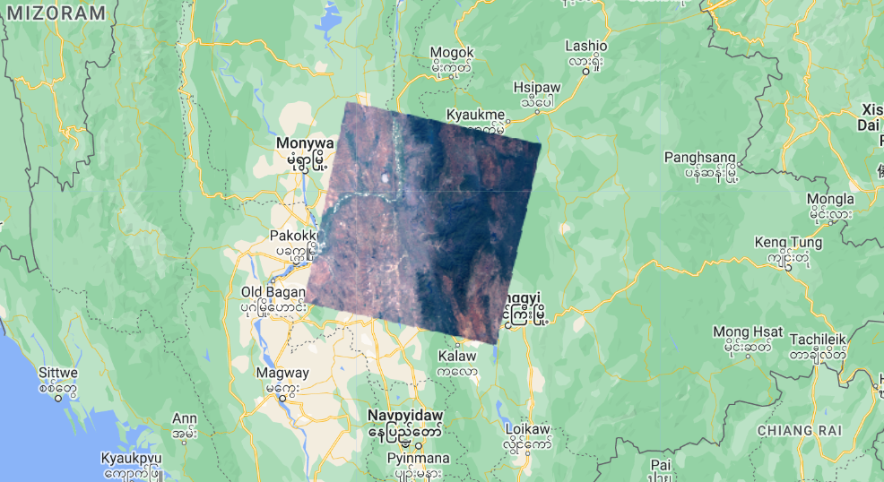

example of output map. If your image appear dark, you can apply the band histogram stretching with '***Stretch: 98%***' 

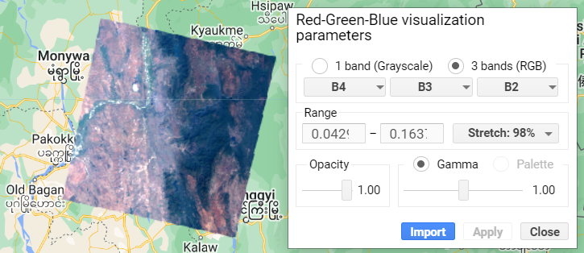

[Link to GEE Demo code](https://code.earthengine.google.com/ba1474f0acc58c17438d892cbcbdfbf1). 

Now save your code in your own data repository.

Demonstration on ***GEE script repository creation and file management***.

### 2.1 Image Metadata

```javascript
///// print the image metadata to console window.
print('Image Property: ', image);
```

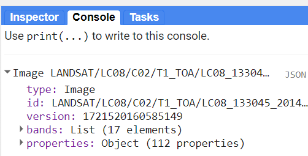

You can can try visualizing the other two images above.


## 3.  Image Visualization Band Combination

The example image contains more than one spectral bands. We will try to visualize other spectral band in the 3 band color composite. Different Satellite and product comes with a different band order. Please check the band name and their respective spectral region on the "Dataset" page and 'BANDS' information. 

Example of Landsat 8 TOA Reflectance bands.

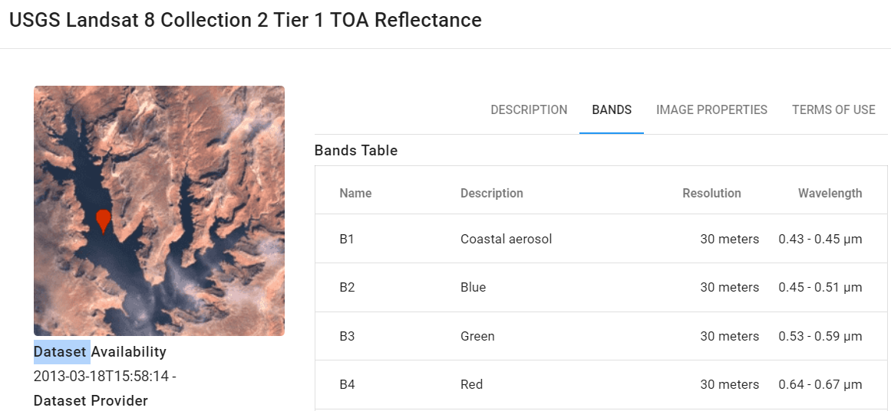

### 2.1 True Color Composite

The 3 bands (Red, Green, Blue) visualization method allow us to visualize spectral information for 3 bands. 

For the natural color or true color composite of Landsat 8 image, we will assign, B4(Red) band, B3 (Green) and B2 (Blue) band to the 3 bands (RGB) in the visualization parameter. The band sequence of one Satellite image may have different band order, please check the description of B1, B3, B3, etc.

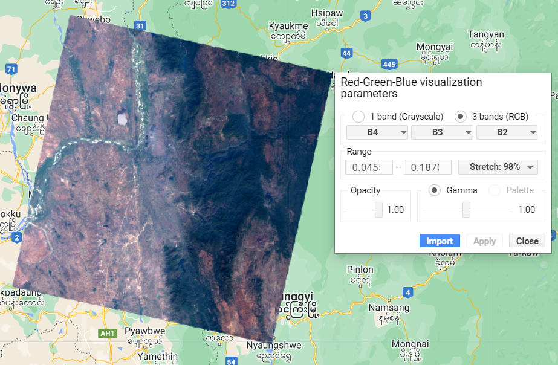

example of output true color composite image.

### 2.2 False Color Composite

Using the 3 bands (Red, Green, Blue) visualization method, we can assign any combination of 3 bands which are not in the natural color. The following examples are false color composite

Below is example for Near Infrared, Red, Green band combination.

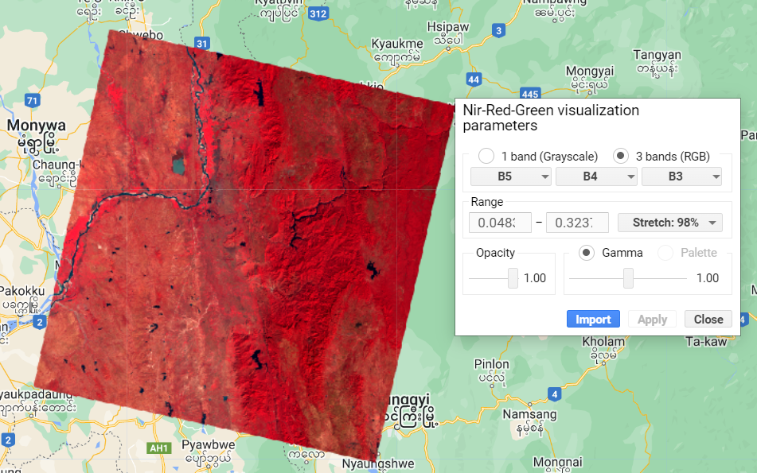


Below is a false color composite of Shortwave Infrared, Near Infrared, Red band combination.

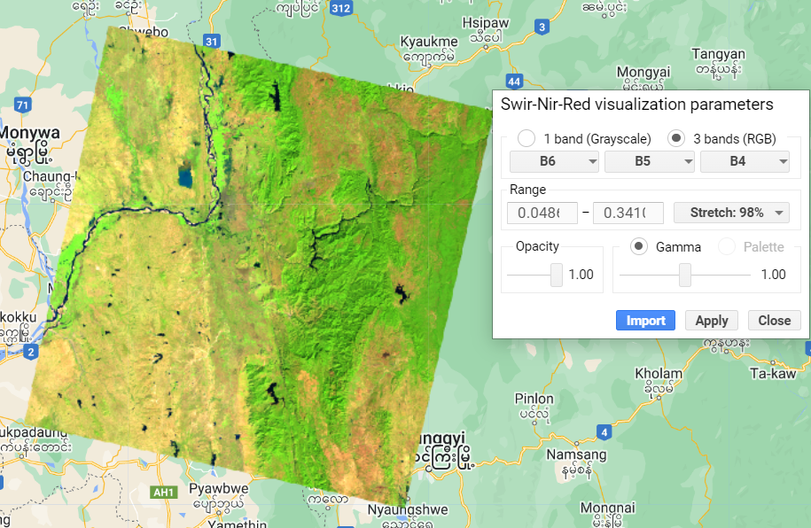

You can try other false color composite for Landsat and Sentinel-2 images.

**Quiz**: Which band combination can highlight the agriculture field?


### 2.2 Grey Scale Image

We can use 1 band (Grayscale) method to visualize a band of an image. 

Example below is a grey scale image of Shortwave Infrared band (B6) with 98% histogram stretching.

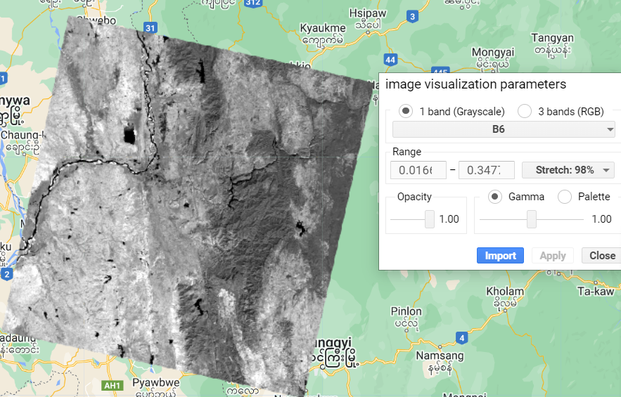

Example below is a grey scale image of Thermal Infrared band (B10) with 98% histogram stretching.

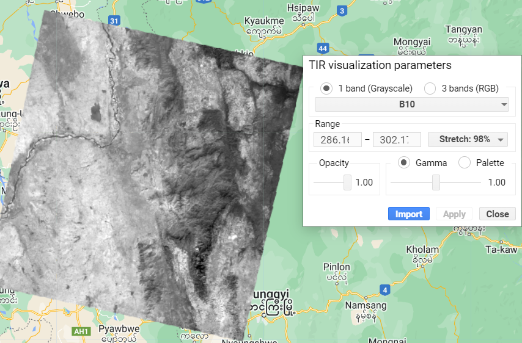

### 2.2 Pseudo Color composite

When visualizing a single band, we can apply different color to make the information contained in the image to become more visible. This will result in Pseudo Color image where the color may not necessary represent the original color from the image. 

Example of Thermal Infrared Band (B10) of Landsat image after applying Pseudo color.

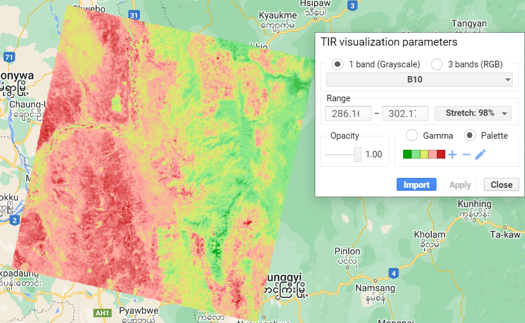

Try with 'false' condition and see the result.

### 2.3 Limit the number of image

Users can limit the number of image in the collection. 

```javascript
//// Limit the collection to the 10 most recent images.
var recent = landsat9Collection.sort('system:time_start', false).limit(10);
print('Recent images: ', recent);
```


## 4. Normalized Difference (Band Math)

To apply mathematic equation to the bands such as Normalized Difference Index to an single image and create a new NDVI image. Below is example of calculation NDVI from Landsat 8,

```javascript
//// to compute (Nir - Red) / (Nir + R)
var ndvi = image.normalizedDifference(['B5','B4'])
```

We can try pseudo color for visualization a single band image and add to the map view.

```javascript
// Make a palette: a list of hex strings.
var palette = ['FFFFFF', 'CE7E45', 'DF923D', 'F1B555', 'FCD163', '99B718',
               '74A901', '66A000', '529400', '3E8601', '207401', '056201',
               '004C00', '023B01', '012E01', '011D01', '011301'];
//// view NDVI image
Map.addLayer(ndvi,{min:-1,max:1,palette:palette},'NDVI')
```

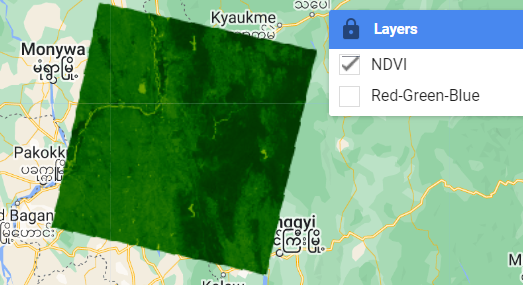

[Link to GEE Demo code](https://code.earthengine.google.com/c45ab54dab76a7b4ef0a5aa656df9621). 

**Assignment**: You can try to calculate the NDVI for Sentinel-2 single image.

## 4. Clipping Image

For processing only the the area of interest, we can clip the image to Area of Interest only. We can use the **image.clip( )** function by providing the geometry to do it. Example of geometry rectangle as AOI.

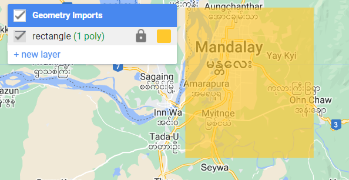

```javascript
//// //// clipping image
var clipped = image.clip(rectangle)
Map.addLayer(clipped,VisRedGreenBlue,'Clip')
```

example of output clipped image.

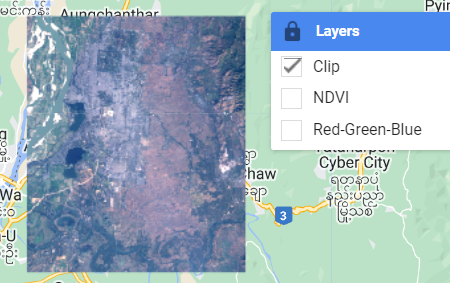

[Link to GEE Script](https://code.earthengine.google.com/ca7217dbbc32bda2ed8a5625d12ee80f).

Assignment: Modify the code and clip the image with your study area.

----

## Reference

[Normalized Difference Example](https://code.earthengine.google.com/eaae9f3592281f06ddaa32006fd01495).

image.expression() [in GEE](https://code.earthengine.google.com/a874c1bc31ed3835674574fac9bfaefd). 

[Image Expressing in GEE](https://code.earthengine.google.com/1376e06a312fbfcdae9d748231608205).

Next --> Geometry, FeatureCollection


```javascript
var image = ee.Image('LANDSAT/LC08/C02/T1_TOA/LC08_133045_20140113');
```


End of this session