# Geometry and Visualization in GEE

A geometry object in geospatial data refers to a mathematical representation of spatial shapes and locations. 

You can create geometries interactively using the Code Editor geometry tools. 

We will learn the basic of image collection concept and filtering image collection in this section.

## 1. Creating Geometry using Geometry Tool

### 1.1 Point

In the GEE JavaScript IDE interface, go to Geometry tool on the upper left corner of the map, 

select +new layer ,  

edit the layer property by clicking on the layer setting, 

give a point layer name '**geometry_Point**', choose a color. Click 'OK'. 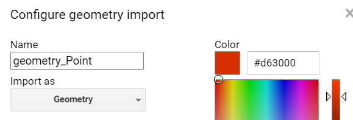

 To draw a point, select the '**geometry_Point**' layer and make it active (layer name turns to bold). 

Select the Point data type icon  on the upper left menu.

Click on  the map canvas where you want to place the point. Below is example of a point geometry in red.

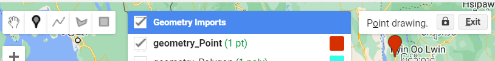

If you add more point to the same point layer, the layer geometry type will become *multipoint* geometry. 

Now you've got the idea how to use the GUI ***Geometry Tool***, you can follow similar way as above for other object types.

[Link to GEE Script.](https://code.earthengine.google.com/25fa2bc4fcf2b5eb0f7fdb847ceb2c50)

### 1.2 Line

In the GEE JavaScript IDE interface, go to Geometry tool on the upper left corner of the map, 

select +new layer ,  select

edit the layer property by clicking on the layer setting

give a point layer name '**geometry_Line**', choose a color. Click 'OK'. 

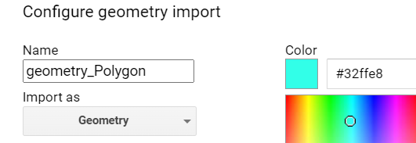

 To draw a line, select the '**geometry_Line**' layer and make it active (layer name turns to bold). 

Select the Line data type icon 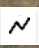 on the upper left menu.

Click on  the map canvas where you want to draw the starting point, continue to add extension of the line and double-click to mark the end of the line object. Below is example of a *line* geometry in blue.

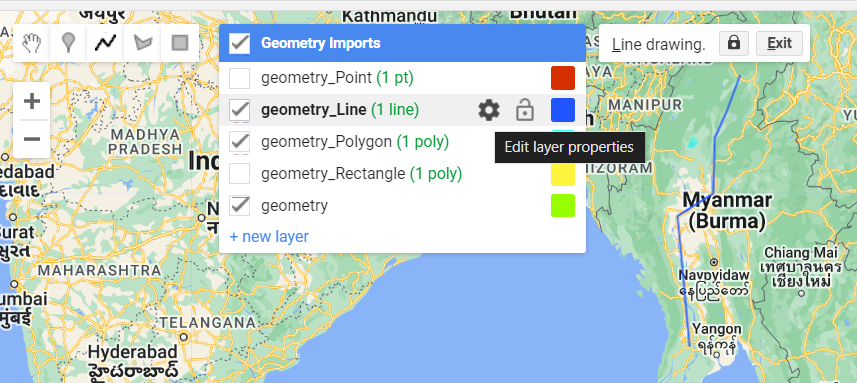

If you add more lines to the same line layer, the layer geometry type will become *multiline* geometry.

[Link to GEE Script](https://code.earthengine.google.com/6bbd56b5cd01c00664a5de38db5ee8d2).

### 1.4 Polygon

In the GEE JavaScript IDE interface, go to Geometry tool on the upper left corner of the map, 

select +new layer ,  select

edit the layer property by clicking on the layer setting

give a point layer name '**geometry_Polygon**', choose a color. Click 'OK'. 

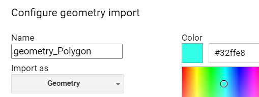

 To draw a line, select the '**geometry_Polygon**' layer and make it active (layer name turns to bold). 

Select the Polygon data type icon 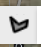 on the upper left menu.

Click on  the map canvas where you want to draw the starting point, continue to add extension of the polygon and double-click to mark the end of the polygon object. Below is example of a *polygon* geometry in cyan.

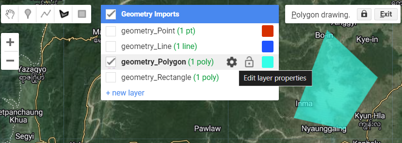

If you add more point to the same point layer, the layer geometry type will become *multipolygon* geometry. 

[Link to GEE Script](https://code.earthengine.google.com/12cc638837acf01590bf8eb02cca2847)

### 1.5 Rectangle

In the GEE JavaScript IDE interface, go to Geometry tool on the upper left corner of the map, 

select +new layer ,  select

edit the layer property by clicking on the layer setting

give a point layer name '**geometry_Rectangle**', choose a color. Click 'OK'. 

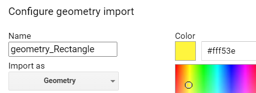

To create a ***Rectangle*** geometry object, select the '**geometry_Polygon**' layer and make it active (layer name turns to bold). 

Select the Polygon data type icon 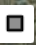  on the upper left menu.

Rectangle geometry needs only two corners. Click on  the map canvas where you want to draw the starting corner and draw ending corner and mark the end of the polygon object. Below is example of a *rectangle* geometry in yellow.


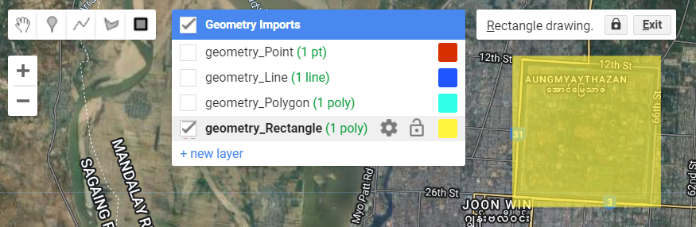

If you add more rectangle to the same layer, the layer geometry type will become *multiRectangle* geometry.

## 2. Editing or Deleting a Geometry Object

#### 2.1 Edit/Move a geometry

To edit or move a geometry, select the geometry object on the map, drag to a new location and drop it.

#### 2.2 Delete a geometry

To delete a geometry, unselect all the geometry. 

Click on the geometry object/icon that you want to delete. 

Click on delete.

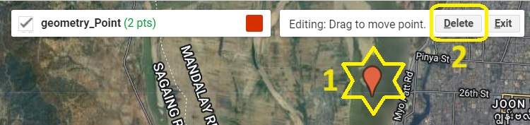

#### 2.3 Locking the Geometry Import Layer

To lock a geometry layer in the GEE JavaScript IDE interface, go to 'Geometry Imports' on the upper left comer of the map display, 

hover your mouse over the layer name, click on the 'lock' icon . The selected geometry layer will be locked from being edited.

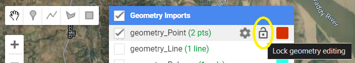

Toggle the 'lock/unlock' icon to unlock a geometry layer. 

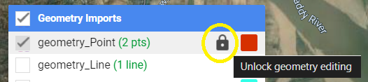

Generated Code from Imported Geometry

We can view and copy the generated code from the import geometry.

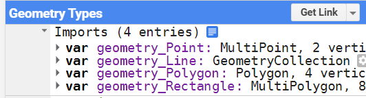

A the top of your GEE Javascript IDE code interface, expend the Imports section triangle icon.

Click on the 'show generated code' 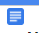, there you can copy the generated JavaScript code of the features we've imported.

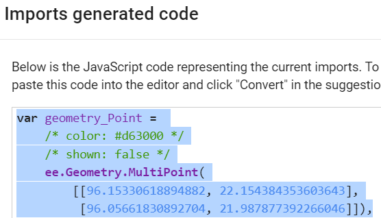

Select and copy the code and paste into the JavaScript program interface. 

**Important Note**: The file size of your Import geometry layer should not be greater than 512 KB. There is a upper limit where your web browser will response slowly. If the imported file size become big or complex, it is suggested to ingest into the GEE Asset.

## 3. Creating Geometry Programmatically

We can create geometry programmatically. This method can be useful when we want to run the script with large geometry dataset or fixed geometry datasets. 

### 3.1 Point

To create a ***Point*** geometry object in Earth Engine, you can use the the **`ee.Geometry.Point()`** method.

```javascript
var point = ee.Geometry.Point([96.5, 20.5]);
```

You can view the point geometry on map instantly  by adding the layer to map display.

```javascript
// Display the geometry by adding it to the map.
Map.addLayer(point,{color:'red'},'Point');
Map.centerObject(point,6);
```

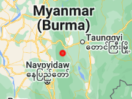

### 3.2 Line

To create a ***Line*** geometry object. geometry object in Earth Engine, you can use the the **`ee.Geometry.MultiLineString()`** method.

```javascript
var line = ee.Geometry.MultiLineString([
    	[95.2, 17.1],
        [96.0, 21.9],
        [96.9, 25.4]]);
```

You can view the point geometry on map instantly  by adding the layer to map display.

```javascript
// Display the geometry by adding it to the map.
Map.addLayer(line,{color:'0000ff'},'Line');
Map.centerObject(line,5);
```

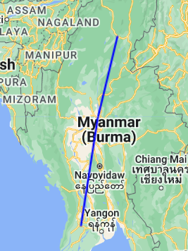

### 3.3 Polygon

To create a ***Polygon*** geometry object. geometry object in Earth Engine, you can use the the **`ee.Geometry.Polygon())`** method.

```javascript
var polygon = ee.Geometry.Polygon([
    [95.20, 23.32],
    [95.41, 23.27],
    [95.56, 23.48],
    [95.34, 23.67]]);
```

You can view the point geometry on map instantly  by adding the layer to map display.

```javascript
// Display the geometry by adding it to the map.
Map.addLayer(polygon,{color:'00ffff'},'Polygon');
Map.centerObject(polygon,9);
```

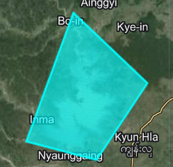

### 3.4 Rectangle

To create a ***Rectangle*** geometry object. geometry object in Earth Engine, you can use the the **`ee.Geometry.Point()`** method.

```javascript
var rectangle = ee.Geometry.Polygon([
   [96.4153, 18.9565],
   [96.4153, 18.9306],
   [96.4474, 18.9306],
   [96.4474, 18.9565]]);
```

You can view the point geometry on map instantly  by adding the layer to map display.

```javascript
// Display the geometry by adding it to the map.
Map.addLayer(rectangle,{color:'ff00ff'},'Polygon');
Map.centerObject(rectangle,12);
```

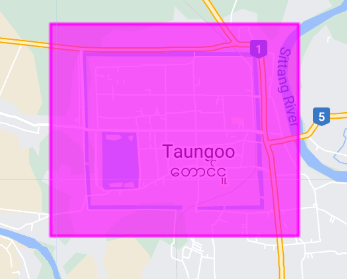

### 3.5 MultiPoint

To create a *MultiPoint* geometry object. geometry object in Earth Engine, you can use the **`ee.Geometry.MultiPoint()`** method.

```javascript
var multiPoints = ee.Geometry.MultiPoint(
        [[96.1900, 16.8837],
         [96.0836, 21.9063],
         [92.8528, 20.2338],
         [99.8511, 20.5067],
         [97.9257, 23.9937],
         [97.4066, 25.3809],
         [98.5862, 10.1880]]);
```

You can view the point geometry on map instantly  by adding the layer to map display.

```javascript
//// Display the geometry by adding it to the map.
Map.addLayer(multiPoints,{color:'00ffff'},'Multipoint');
Map.centerObject(multiPoints,4);
```

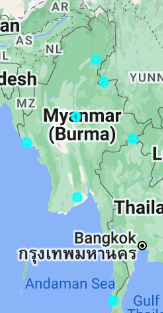

## 4. Converting Geometry to FeatureCollection

We can convert geometry object into the **FeatureCollection** object programmatically.

example

### 1.1 MultiPoint Geometry to FeatureCollection

```javascript
var multiPoints = ee.Geometry.MultiPoint(
        [[96.1900, 16.8837],
         [96.0836, 21.9063],
         [92.8528, 20.2338],
         [99.8511, 20.5067],
         [97.9257, 23.9937],
         [97.4066, 25.3809],
         [98.5862, 10.1880]]);


```

We can use the **ee.FeatureCollection( )** method to convert geometry object into FeatureCollection.

```javascript
//// Convert geometry into FeatureCollection
var feature = ee.FeatureCollection(multiPoints);
```

Let's learn to apply style for displaying featureCollection object on the map canvas.

```javascript
//// use style to color the featureCollection (not in Geometry)
var visStyle = {color:'red',pointSize:10,pointShape:'star',fillColor:'yellow'}
```

Now, we are going to display the new featureCollection object on map.

```javascript
//// add to map display with new style
Map.addLayer(feature.style(visStyle),{},'feature');
Map.centerObject(multiPoints,4);
```

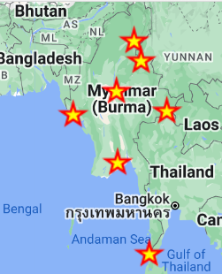

[Link to GEE Script](https://code.earthengine.google.com/5af8bef2fd670857381850508dc437a1)

## 5. Creating FeatureCollection Using GUI Geometry Tool

We have learnt how to create geometry object using the Geometry Tool. In similar way, we can create FeatureCollection.

Our crop mapping model requires training samples as FeatureCollection objects!

Let's create Point **FeatureCollection** object for collecting rice field location.

[Link to GEE Script](https://code.earthengine.google.com/1296238804ec8d656bb11ab821cddfca)

### 5.1 Creating FeatureCollection for Rice Samples

In the GEE JavaScript IDE interface, go to Geometry tool on the upper left corner of the map, 

select +new layer ,  

edit the layer property by clicking on the layer setting, 

give a point layer name '**Rice_Point**', pick a YELLOW color for rice. 

Expand the '**Import as**' and choose '**FeatureCollection**'.


To set the Property, Click on the +Property, a new property table will appear.

Enter 'class' as property name and enter '1' for its Value.

Click 'OK'.  Your property setting should look like below image.


 To collect rice field location sample point and add to the Rice_Point featureCollection.

select the '**Rice_Point**' layer and make it active (layer name turns to bold). 

Select the Point data type icon  on the upper left menu.

Click on  the map canvas where you want to collect the rice point

### 5.2 Creating FeatureCollection for Non-Rice Samples

When we run the crop mapping model we will also need to have samples which are not rice outside of the rice field.

Let's create a FeatureCollection object for non-rice samples.

In the GEE JavaScript IDE interface, go to Geometry tool on the upper left corner of the map, 

select +new layer ,  

edit the layer property by clicking on the layer setting, 

give a point layer name '**NonRice_Point**', pick a YELLOW color for rice. 

Expand the '**Import as**' and choose '**FeatureCollection**'.


To set the Property, Click on the +Property, a new property table will appear.

Enter '**class**' as property name and enter '**0**' for its Value.

Click 'OK'.  Your property setting should look like below image.


 To collect rice field location sample point and add to the Rice_Point featureCollection.

select the '**Rice_Point**' layer and make it active (layer name turns to bold). 

Select the Point data type icon  on the upper left menu.

Click on  the map canvas where you want to collect the rice point

[Link to GEE Code](https://code.earthengine.google.com/5af8bef2fd670857381850508dc437a1). 

## 6. Creating FeatureCollection

FeatureCollection.

[Link to GEE Code](https://code.earthengine.google.com/b13936fad301a945f73104e310453cee).

Search country boundary from the data catalogue. Select and import the FAO World 

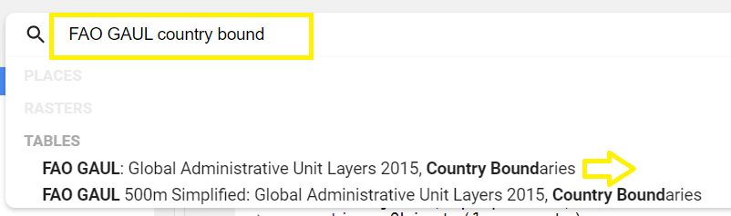 

Rename the featureCollection as '**world**'.

We can print the first object to see the metadata fields using **.first( )** method and add the featureCollection to the map.

```javascript
print(world.first());

Map.addLayer(world,{},'world');
```

Example of map

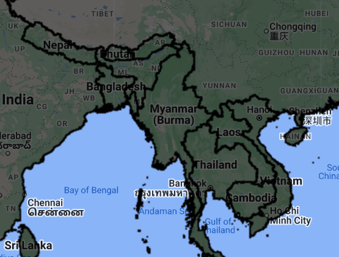

[Link to GEE Code](https://code.earthengine.google.com/e23456266749df834d049531439d6ca7) 2.

Filtering FeaturCollection

[Link to GEE Script](https://code.earthengine.google.com/7b9ac122f0968d065fc09fdfd7ce88a5).

Filtering FeatureCollection by Attribute property.

[Link to GEE Code](https://code.earthengine.google.com/2ddbd5cee7f607bb28a90b792baac153). 

Filtering FeatureCollection OR

[Link to GEE Code](https://code.earthengine.google.com/7b9ac122f0968d065fc09fdfd7ce88a5).

-----

Next --> Sample Collection from Satellite Images

print(world.first())

Map.addLayer(world,{},'world')

startCOPY

```javascript
var image = ee.Image('LANDSAT/LC08/C02/T1_TOA/LC08_133045_20140113');
```

endCOPY

End of this session