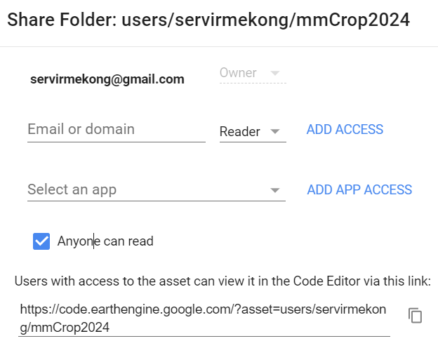

# Creating Cloud Free Sentinel-2 Composite

We will learn how to create cloud free Sentinel-2 image composite from image collection in this section.

## 1. Create GEE Asset repository framework of Sentinel2 image

Script tab , New > code repository >

GEE Asset folder path: 

https://code.earthengine.google.com/?asset=users/servirmekong/mmCrop2024




## 2. Setup Parameters

*define the necessary parameters for the image collection and cloud filtering.*

```javascript
// Define the start and end date for the image collection
var START_DATE = '2022-05-01';
var END_DATE = '2022-10-31';

// Define the maximum percentage of cloud cover allowed in images
var CLOUD_FILTER = 70;

// Thresholds for cloud probability and dark pixels
var CLD_PRB_THRESH = 40; // Cloud probability threshold
var NIR_DRK_THRESH = 0.15; // Near-infrared dark pixel threshold

// Distance to project cloud shadows (in pixels)
var CLD_PRJ_DIST = 2;

// Buffer distance to dilate cloud/shadow mask (in pixels)
var BUFFER = 50;
```

### **2.1 Define the Area of Interest (AOI)** 

Now add the image with parameter in the map window.

```javascript
// Import feature collection
var countries = ee.FeatureCollection("FAO/GAUL_SIMPLIFIED_500m/2015/level2");

//print('country',countries.first())
// group by property name
//print('group by country names:',countries.aggregate_histogram("ADM0_NAME"))

var mycountry = countries.filter(ee.Filter.eq("ADM0_NAME","Myanmar"))

//Map.addLayer(mycountry,{},'mycountry')
//print(mycountry.aggregate_histogram("ADM2_NAME"))

var AOI = mycountry.filter(ee.Filter.eq("ADM2_NAME","Taungoo")).geometry()
//Map.addLayer(AOI,{},'Province 1')
```

Let's set the map view to the center of the image as below code.

```javascript
Map.centerObject(image)
```


example of output map. If your image appear dark, you can apply the band histogram stretching with '***Stretch: 98%***' 


### 2.1 **Define Function to Get Sentinel-2 Cloud-Free Image Collection**

```javascript
function get_s2_sr_cld_col(aoi, startDate, endDate) {
    // Import the Sentinel-2 surface reflectance image collection
    var s2_sr_col = ee.ImageCollection('COPERNICUS/S2_SR')
        .filterBounds(aoi) // Filter the collection by the area of interest
        .filterDate(startDate, endDate) // Filter by date range
        .filter(ee.Filter.lte('CLOUDY_PIXEL_PERCENTAGE', CLOUD_FILTER)); // Filter by cloud cover percentage
    
    // Import the Sentinel-2 cloud probability image collection
    var s2_cloudless_col = ee.ImageCollection('COPERNICUS/S2_CLOUD_PROBABILITY')
        .filterBounds(aoi) // Filter the collection by the area of interest
        .filterDate(startDate, endDate); // Filter by date range

    // Join the two collections by their 'system:index' property
    return ee.ImageCollection(ee.Join.saveFirst('s2cloudless').apply({
        'primary': s2_sr_col,
        'secondary': s2_cloudless_col,
        'condition': ee.Filter.equals({
            'leftField': 'system:index',
            'rightField': 'system:index'
        })
    }));
}
```


You can can try visualizing the other two images above.


Text.

javascript code css/

startCOPY

```javascript
var image = ee.Image('LANDSAT/LC08/C02/T1_TOA/LC08_133045_20140113');
```

endCOPY

End of this session