# Working with ImageCollection

We will learn the basic of image collection concept and filtering image collection in this section.

## 1. ImageCollection

An `ImageCollection` is a stack or sequence of images. An `ImageCollection` can be loaded by pasting an Earth Engine asset ID into the `ImageCollection` constructor. You can find `ImageCollection` IDs in the [data catalog](https://developers.google.com/earth-engine/datasets).

Example 1, Landsat-8 top of atmosphere reflectance collection

```javascript
var landsat8Collection =  ee.ImageCollection("LANDSAT/LC08/C02/T1_TOA");`
```

Example 2, Sentinel-2 surface reflectance collection

```javascript
///// loading an ImageCollection
var sentinelCollection = ee.ImageCollection('COPERNICUS/S2_SR');
var sentinelCollectionHM = ee.ImageCollection("COPERNICUS/S2_SR_HARMONIZED")
```

### 1.1. ImageCollection Visualization

You can view the image collection in the map view. 

Example 1, Landsat-8 TOA collection

```javascript
var VisRedGreenBlue = {"opacity":1,"bands":["B4","B3","B2"],"min":0.04,"max":0.18,"gamma":1};

Map.addLayer(landsat8Collection,VisRedGreenBlue,'image Collection');
```

example of map. 

[Link to GEE Script](https://code.earthengine.google.com/325db8694d3e88a37a048ca5b0be1dc9).

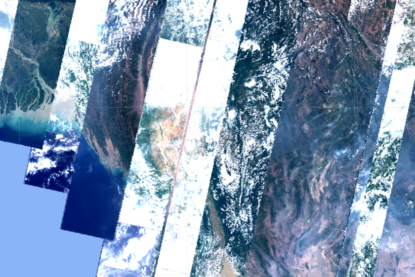

Example 2, Sentinel-2

```javascript
Map.addLayer(sentinelCollection,{},'sentinel Collection')
```

X, map too slow to show. 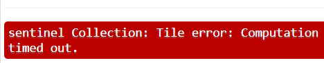

It will be too much images to load on the map display on the map. We need to filter and select only some images.


## 2.  ImageCollection Information and Metadata

### 2.1 Counting number of images

Let's count the number of images from the image collection. we can count the number of images from the image collection with **imageCollection.size( )** method.

```javascript
// Get the number of images.
var count = landsat8Collection.size();
print('Number of image: ', count);
```

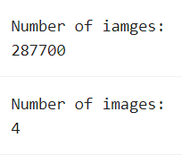

There will be a lot of images. We will need to filter and select only the images that we need for our crop mapping as below sections.

### 2.2 Sorting

We have learnt how to print the image metadata information. From the metadata information, we will use '**CLOUD_COVER**' property to filter the Landsat images.

Sort the image property value by ascending or descending order. 

```javascript
//// Sort by a cloud cover property, get the least cloudy image.
var image = ee.Image(landsat8Collection.sort('CLOUD_COVER',true).first());
print('Least cloudy image: ', image);
```

[GEE Code Link](https://code.earthengine.google.com/ce20daf61d89de37fdb6e194627e49b9). example

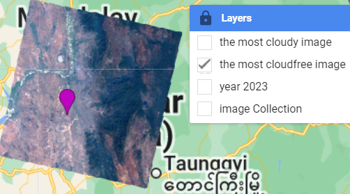

Try with '*false*' condition and see the result.

### 2.3 Limit the number of image

Users can limit the number of image in the collection. 

```javascript
//// Limit the collection to the 10 most recent images.
var recent = landsat9Collection.sort('system:time_start', false).limit(10);
print('Recent images: ', recent);
```

## 3. Filtering an ImageCollection

### 3.1. Filtering ImageCollection by Geometry 

Let's add one point geometry

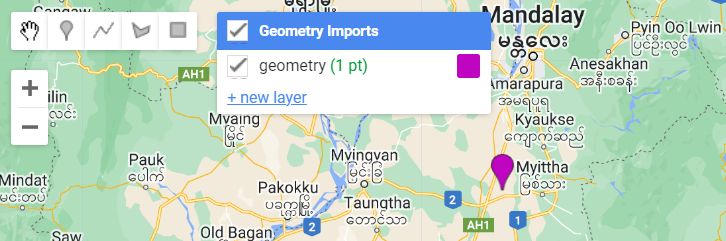

To filter by geometry, we can use imageCollection**.filterBounds( )** method by providing our geometry ( 1 geometry point here in example).

Example 1, Landsat 8 images.

```javascript
//// filter by Geometry
var selected = landsat8Collection.filterBounds(geometry)
```

Let's add the selected image into the map view.

```javascript
//// add to map and count the number of image
Map.addLayer(selected,VisRedGreenBlue,'selected')
print('Number of images:',selected.size())
```

example of result

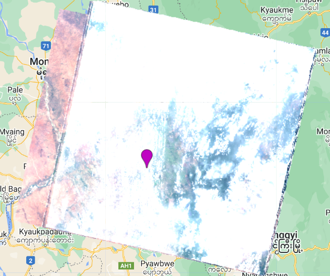jscode

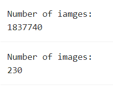

Example 2, Filtering Sentinel-2 imageCollection with geometry.

```javascript
//// filter by Geometry
var selected = sentinelCollection.filterBounds(geometry);
```

Let's add the selected image into the map view.

```javascript
//// add to map and count the number of image
var visRGB = {"opacity":1,"bands":["B4","B3","B2"],"min":1877.96,"max":8500.04,"gamma":1};

Map.addLayer(selected,visRGB,'sentinel Collection')

// Get the number of images.
var count = selected.size();
print('Number of Image: ', count);

```

example of result.

[Link to GEE Script](https://code.earthengine.google.com/ffd9dd5c030c3e0f4f2ffb51859f6dff)

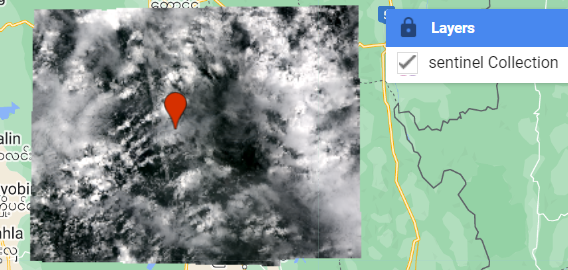

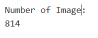


### 3.2. Filtering ImageCollection by Date Range

We want to select images for a certain period only for our interest, crop mapping for rainy and summer season period. 

To filter by date range, filterDate() method can be used. This method requires starting and ending date in YYYY-MM-DD format. After filter by geometry we will filter by date range.

jscode

```javascript
////// filter by Date Range
selected = selected.filterDate('2023-01-01','2023-12-31')
print('Number of images in 2023:',selected.size()) 
```

We have found 20 images in 2023 for the selected location.

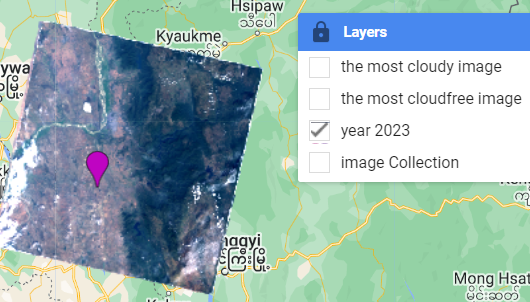

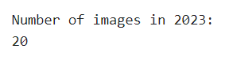

Now we can try to find the most cloud free image in 2023 using '**sort( )**' method.

```javascript
/////// sort by cloud property
var leastcloud = selected.sort("CLOUD_COVER",true)
var mostcloud = selected.sort("CLOUD_COVER",false)
print('most cloud free image:',leastcloud.first())
```

Example most cloud free image in 2023 for selected point.

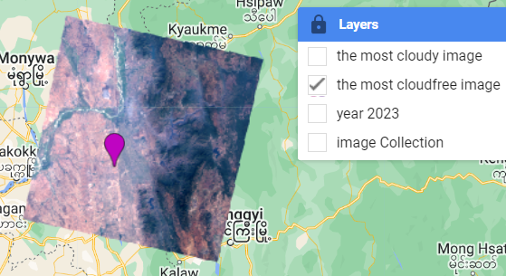

Metadata information of most cloud free image.

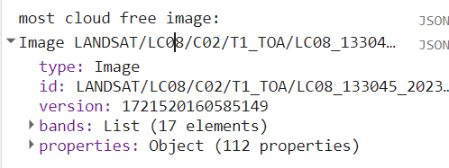

**Assignment**: Please change the geometry location, the year range and do filtering of imageCollection by modifying the code.

In practical usage we can combine the script for filtering to make it shorter. Example

```javascript
//// filter by Geometry and date
var selected = landsat8Collection.filterBounds(geometry)
                .filterDate('2020-01-01','2020-12-31')
```

[Link to GEE Script](https://code.earthengine.google.com/6a5eabc9fe6fb6d75762823216d1e7db).


## 4. Reducing an ImageCollection

 To composite images in an `ImageCollection`, use `imageCollection.reduce()`. This will composite all the images in the collection to a single image representing, for example, the min, max, mean or standard deviation of the images. 


5.1. Mean

Example of reducing to median image

```javascript
//// Compute a median image and display.
var median = landsat8Collection.mean();
// Display the median image.
Map.addLayer(median,VisRedGreenBlue,'median');
```

Output image

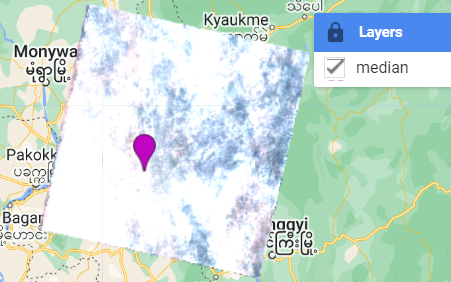

2.1. Medium

Example of reducing to mean image

```javascript
//// Compute a median image and display.
var median = landsat8Collection.mean();
// Display the median image.
Map.addLayer(median,VisRedGreenBlue,'median');
```

Output image

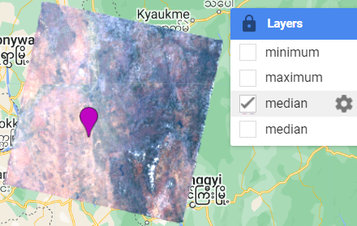

2.1. Maximum

Example of reducing to Maximum image

```javascript
//// Compute a maximum image and display.
var max = selected.max();
Map.addLayer(max,VisRedGreenBlue,'maximum');
```

Output

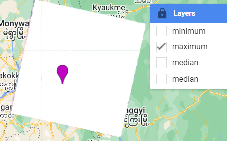

a

2.1. Minimum

Example of reducing to minimum image

```javascript
//// Compute a minimum image and display.
var min = selected.min();
Map.addLayer(min,VisRedGreenBlue,'minimum');
```

Output image

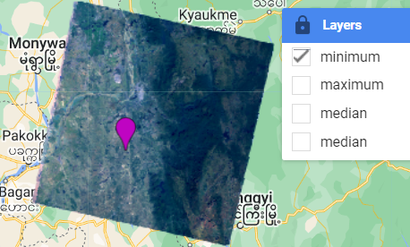

These examples contain images with cloud. The resultant composite images may not contain good quality data. It is suggest to apply cloud removal before doing the image reducing in the actual application. 

**Note**: Composites created by reducing an image collection have [the default projection](https://developers.google.com/earth-engine/guides/projections#the-default-projection) of WGS-84 with 1-degree resolution pixels. Composites with the default projection will be computed in whatever output projection is requested. A request occurs by displaying the composite in the Code Editor (learn about how the Code editor sets [scale](https://developers.google.com/earth-engine/guides/scale#scale-of-analysis) and [projection](https://developers.google.com/earth-engine/guides/projections)), or by explicitly specifying a projection/scale as in an aggregation such as `ReduceRegion` or `Export`.

## 5.  Mapping Over an ImageCollection

We have learn the calculation of NDVI in the previous section. What if we want to calculate NDVI image for every image in the imageCollection, we can use .map() function to do it. 

To apply a function to every `Image` in an `ImageCollection` use `imageCollection.map()`. The only argument to `map()` is a function which takes one parameter: an `ee.Image`. For example, let's calculate NDVI for Landsat 8 TOA image.

we will add a function that calculates NDVI and add NDVI bands to the original image.

jscode

```javascript
// This function create NDVI iamge and adds NDVI band to original image.
var calcNDVI = function(image) {
  var ndvi = image.normalizedDifference(['B5','B4']).rename('NDVI')
  return image.addBands(ndvi);
};
```

Another method using ***expression( )***.

```javascript
/////// A function to compute Soil Adjusted Vegetation Index.
var calcSAVI = function(image) {
 var savi =  image.expression(
      '(1 + L) * float(nir - red)/ (nir + red + L)',
      {
        'nir': image.select('B4'),
        'red': image.select('B3'),
        'L': 0.2
      }).rename('SAVVI');
return image.addBands(savi);
};
```

From the main collection, we will call the NDVI calculation function with mapping function sending each and every image in the imageCollection.

```javascript
////// Map the function over the collection and display the result. select only NDVI image after the function 
var NDVI = selected.map(calcNDVI2).select('NDVI')
var SAVI = selected.map(calcSAVI).select('SAVI')

Map.addLayer(NDVI,{},'NDVI timeseries')
Map.addLayer(SAVI,{},'SAVI timeseries')
```

Output NDVI image 

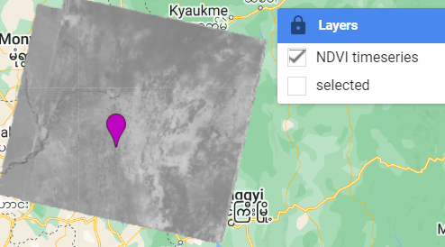

Open the Inspector tab on the upper right pane, the cursor will chagne to cross-hair mode. 

Click on the NDVI image, the inspector tool will extract the pixel values from all images in the image collection. 

In the Inspector tab, go to the list of NDVI image, view the data Series into a time-series chart. 

Click on different land cover type in the NDVI image and observe the vegetation growth and vegetation cycle of different land cover types from the time-series charts. We will use the phenology cycle information to help identifying crop types in next session.

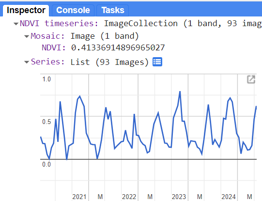

You can adjust the date range for your crop area in the GEE script.

[Link to GEE Script](https://code.earthengine.google.com/ddae3ddad25a4979afb7a8f523b12757).

**Assignment**: Apply the NDVI calculation to Planet image collection.

-----

Next --> Cloud Filtering, Image Compositing and Mosaicking


Text.

jscode

```javascript
var landsat8Collection =  ee.ImageCollection("LANDSAT/LC08/C02/T1_TOA");`
```

jscode
