# Importing Data to GEE Asset

In this section, we will learn how to import data from our computer to GEE Asset.

Go to Assets tab on the left pane of your GEE JavaScript code interface, Google allow the following data type to import into the GEE Asset.

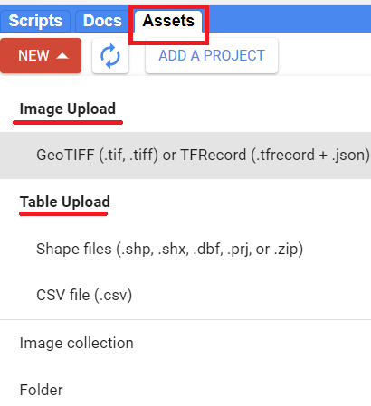

Image : Raster GeoTiff format or TFRecord format.

Table: CSV, ESRI Shapefile or zip file

## 1. Prepare data in local machine

What if I have a digitize smaple in Google KML/KMZ format?

If you have sample point/polygon in Google KML format, you can convert them to ESRI Shapefile format as below.

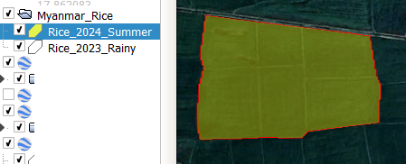

1.1. Convert Google KML file to ESRI Shapefile

Use QGIS to convert KML file to ESRI Shapefile.

Drag and drop your KML file into the QGIS map template.

Select the KML layer file name and Save as.

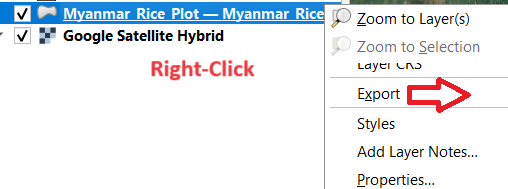

Save the 

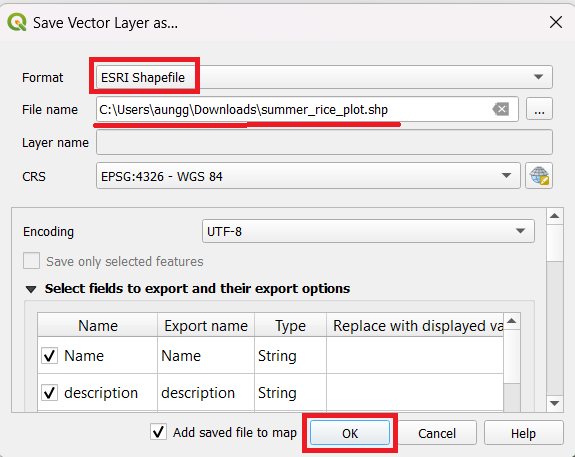

GEE Asset folder path: 

## 2. Upload Data to GEE Asset

We will upload ESRI Shapefile from local computer to Google Asset. 

2.1. Create Folder in Google Asset.

Firstly, we need to create a folder in your GEE Asset to store the file.

Go to Assets tab on the left pane of your GEE JavaScript code interface, -> Click on New -> Select Folder

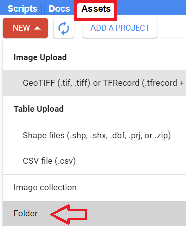

Select the root folder with your name under users/ 

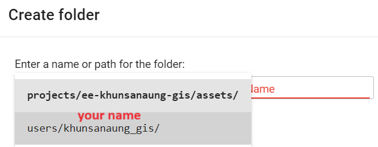

Enter the new folder name, e.g. **mmCropData** and click on OK. 

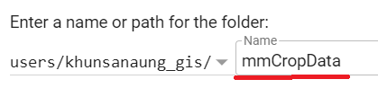

Now, click on the Refresh button and check your newly created folder.

It should appear under the LEAGCY ASSETS.

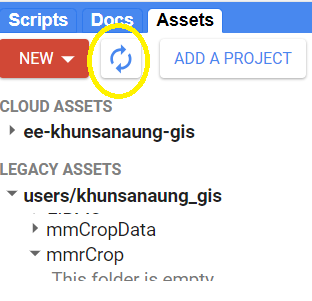


2.2. Uploading ESRI Shapefile

 Go to Assets tab on the left pane of your GEE JavaScript code interface, -> Click on New -> Select Shape files

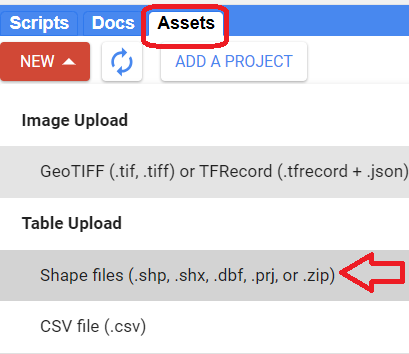

Select your Shape files from your local computer.

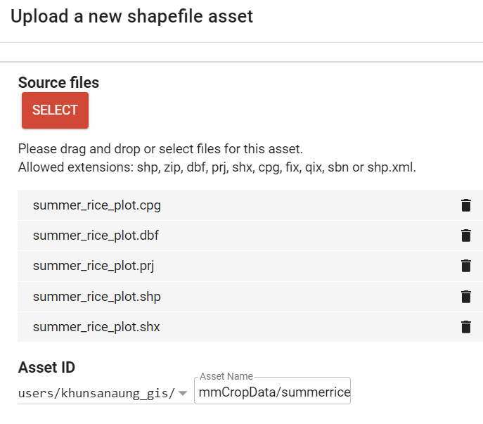

Select your asset root (**users/your_name/**), enter your data folder name (**mmCropData/**) followed by your new file name (**summerrice2024**).

Click on Upload.

A new task would appear.

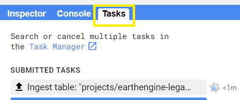

Once the ingesting task is done successfully, click on **View asset** in the Tasks list.

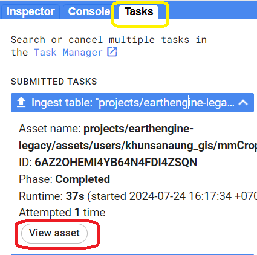

.

Asset details window will pop up. You can see the Table ID of your objects. You can always use this Asset ID in your script.

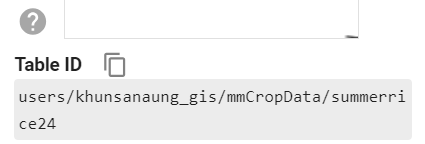

## 3. Importing datasets from GEE Asset to JavaScript Code

Text.

Navigate to your GEE Assets tab, Expand the LEGACY ASSETS. Under your users/your_name/ and the asset ID.  

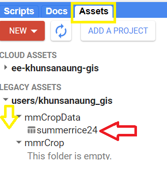 

Click on **IMPORT** on the upper right, To import the the newly created file into your GEE JavaScript editor, 

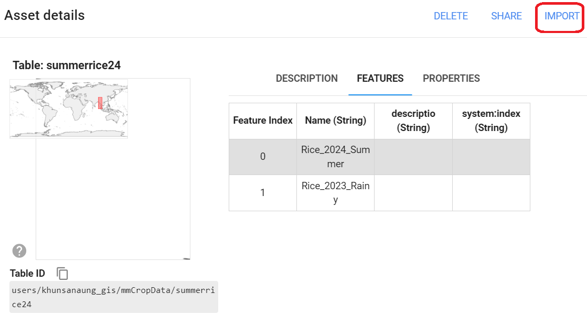

Now, you should see the asset table in the **Imports** section.

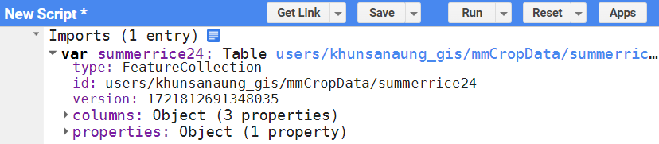

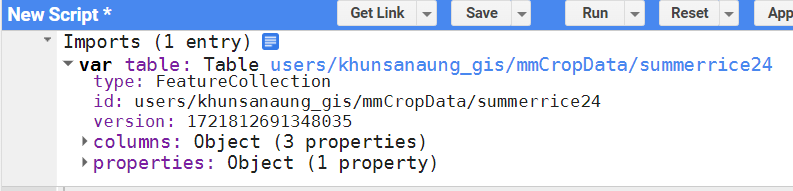

You can rename the table into '**summerrice24**'.

3.1. Merging new sample with existing samples.

Let's say you have an existing rice sample and you want to add new sample in it to combine into one file.

I will assume my existing file in GEE Asset is ''summerrice24''.

```javascript
var summerrice24 = ee.FeatureCollection("users/khunsanaung_gis/mmCropData/summerrice24");

Map.addLayer(summerrice24,{color:'yellow'},'rice Polygon');
Map.centerObject(summerrice24)
```

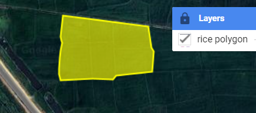

3.2. Creating a new polygon form the Geometry tools and name it as 'newPolygon'.

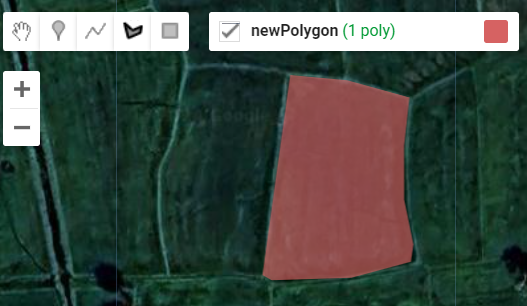

### 3.3. Combining two FeatureCollecton into one FeatureCollection file.

We can create a new FeatureCollection on the fly using list and then apply the  **.flatten( )** method.

```javascript
//// combine existing file with new file.
var combined = ee.FeatureCollection([summerrice24,newPolygon]).flatten();

Map.addLayer(combined,{color:'cyan'},'combined');
```

Example of combined output.

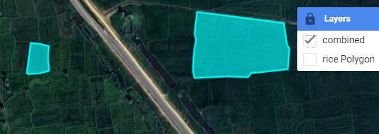

You can combine existing rice point file with new rice point file.

```javascript
//// combine existing file with new file.
var combinedRicePoints = ee.FeatureCollection([oldRicePoints,newRicePoints]).flatten();
```

You can combine non-rice assets into one non-rice file.

```javascript
//// combine existing file with new file.
var combinedNotRicePoints = ee.FeatureCollection([water,builtup,forest,shrubland,grassland,]).flatten();
```

**Note:** Using feature.merge( ) is not efficient for big data size.  


**[Link to GEE Code](https://code.earthengine.google.com/cfc08dad274de565c8a3023024963c0c).**


သီဟိုဠ်မှ ဉာဏ်ကြီးရှင်သည် အာယုဝဍ်ဎနဆေးညွှန်းစာကို ဇလွန်ဈေးဘေးဗာဒံပင်ထက် အဓိဋ္ဌာန်လျက် ဂဃနဏဖတ်ခဲ့သည်။ယေဓမ္မာ ဟေတုပ္ပဘဝါ တေသံ ဟေတုံ တထာဂတော အာဟ တေသဉ္စ ယောနိရောဓေါ ဧဝံ ဝါဒီ မဟာသမဏော။(မြန်မာပြန်)မြတ်စွာဘုရားရှင်သည် ရှေးကပြုခဲ့ဖူးသော အကြောင်းတရားကြောင့် ဖြစ်ပေါ်လာကြသော အကျိုးတရားကို ဟောကြားတော်မူသည်။ထိုအကြောင်းတရားတို့၏ ချုပ်ငြိမ်းရာတရားတို့ကိုလည်း ဟောတော်မူ၏။ရဟန်းကြီးဖြစ်သော ဗုဒ္ဓမြတ်စွာဘုရားသည် ဤသို့သောအယူရှိတော်မူ၏။

---------

Next: 04-Sentinel-2 Image and NDVI Time-series Profile

startJscript

```javascript
var image = ee.Image('LANDSAT/LC08/C02/T1_TOA/LC08_133045_20140113');
```

endJscript

End of this session