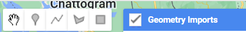
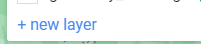
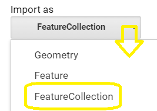
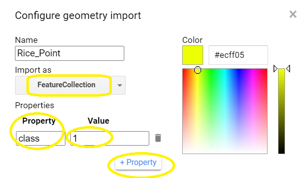
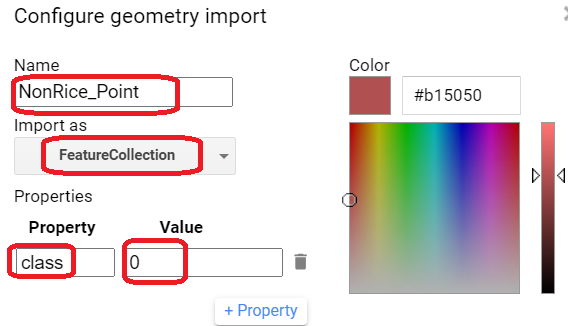
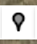

# Preparation for Training Sample Collection

We have learnt geometry object and featureCollection objects in GEE using the Code Editor geometry tools in the previous sections.   In similar way, we can create FeatureCollection in this section.

Our crop mapping model requires training samples as FeatureCollection objects!

We will learn how to create training samples for crop mapping model in this section.

## 1. Creating Training Samples Using GUI Geometry Tool

Let's create Point **FeatureCollection** object for collecting rice field location.

### 1.1 Creating FeatureCollection for Rice Samples

In the GEE JavaScript IDE interface, go to Geometry tool on the upper left corner of the map, 

select +new layer ,  

edit the layer property by clicking on the layer setting, 

give a point layer name '**Rice_Point**', pick a YELLOW color for rice. 

Expand the '**Import as**' and choose '**FeatureCollection**'.

To set the Property, Click on the +Property, a new property table will appear.

Enter 'class' as property name and enter '1' for its Value.

Click 'OK'.  Your property setting should look like below image.

### 1.2 Creating FeatureCollection for Non-Rice Samples

When we run the crop mapping model we will also need to have samples which are not rice outside of the rice field.

Let's create a FeatureCollection object for non-rice samples.

In the GEE JavaScript IDE interface, go to Geometry tool on the upper left corner of the map, 

select +new layer ,  

edit the layer property by clicking on the layer setting, 

give a point layer name '**NonRice_Point**', pick a YELLOW color for rice. 

Expand the '**Import as**' and choose '**FeatureCollection**'.

To set the Property, Click on the +Property, a new property table will appear.

Enter '**class**' as property name and enter '**0**' for its Value.

Click 'OK'.  Your property setting should look like below image.

## 2. Training Sample Collection GUI Geometry Tool

Let's create Point **FeatureCollection** object for collecting rice field location.

To collect rice field sample, we will use a combination of information.

1. Seasonal composite image (monsoon, summer, etc.)
2. The rice growth information during the rice sown period (NDVI time-series Profile)
3. Monthly high resolution image (Planet 4.7m image)
4. Rice sown information from the field (your crop field data)

A. Base Image. Let's import the base seasonal image to GEE JavaScript.

GEE Code.

B. Base Image, Let's add monthly Plante Image for our crop growing season.

C. Vegetation Growth Profile, A template for Planet NDVI time-series profile

D. Import your field data if you have.

### 2.1 Collecting Rice Samples

 To collect rice field location sample point and add to the Rice_Point featureCollection.

select the '**Rice_Point**' layer and make it active (layer name turns to bold). 

Select the Point data type icon  on the upper left menu.

Click on  the map canvas where you want to collect the rice point

### 2.2 Collecting Non-Rice Samples

In the GEE JavaScript IDE interface, go to Geometry tool on the upper left corner of t

 To collect rice field location sample point and add to the Rice_Point featureCollection.

select the '**Rice_Point**' layer and make it active (layer name turns to bold). 

Select the Point data type icon  on the upper left menu.

Click on  the map canvas where you want to collect the other samples which are not rice.

---

End of this session