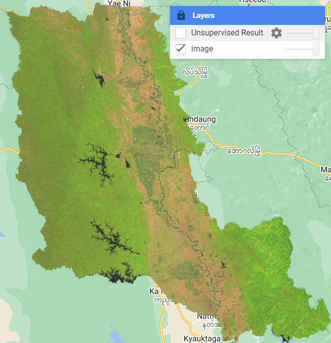
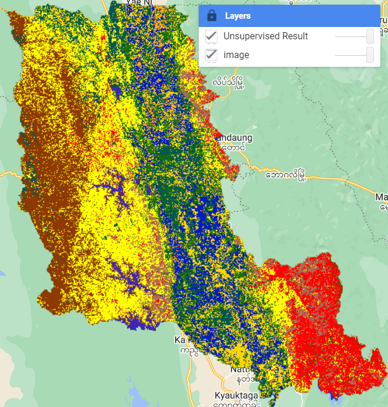

# Unsupervised Classification

We will walk through unsupervised image classification in this exercise.

## 1. Defining Number of Cluster

To perform unsupervised classification, we need to define how many classes (clusters) we want.

We will start with 10 classes.

```javascript
////////////////////////////////////
//// Script: Unsupervised Classification
//// Job: To perform unsupervised Classification
////
/////////////////////////////////////

///////////////////////////
//// variable
// Define the number of clusters
var numClusters = 10;
```

## 2. Area of Interest

Filter to area of interest

```javascript
///////////////////////////
//// Import area of interest 
var countries = ee.FeatureCollection("FAO/GAUL_SIMPLIFIED_500m/2015/level2");
var mycountry = countries.filter(ee.Filter.eq("ADM0_NAME","Myanmar"))
var AOI = mycountry.filter(ee.Filter.eq("ADM2_NAME","Taungoo")).geometry()
```

## 3. Input Image

We'll use the composite image exported in the earlier session.

If you want to use your own image composite, please change the image AssetID path according.

```javascript
//// Composite Image
var image = ee.Image("users/vteck/MYM/Taungoo_s2_2023")
Map.addLayer(image, {min:0, max:6000, bands:["B11", "B8", "B4"]}, "image");
```



## 4. Unsupervised Classification

### 4.1 Sample the image

To perform unsupervised classification, we need to start taking **samples** from the input image and use ***K-Means*** method for classification.

We will use 5000 number of pixel within our study area.

```javascript
//------------------------------------
//// Image Classification
//// 1. Instantiate the clusterer and train it
var Clusterer = ee.Clusterer.wekaKMeans(numClusters).train({
  features: image.sample({
    region: AOI,
    scale: 30,
    numPixels: 5000
  }),
  inputProperties: image.bandNames()
});

```

### 4.2 Classify the image

Once we've got the classification tree, we will apply this to input image to perform classification to the whole image.

```javascript
//// 2. Classify the image
var classified = image.cluster(Clusterer);

```

### 4.3. Classification Result

We create some color for clusters and add to classified image to the map.

```javascript
// Visualization parameters for classified image
var visParams = {
  min: 0,
  max: numClusters - 1,
  palette: ['red', 'green', 'blue', 'orange', 'yellow']
};

// Add the classified image layer to the map
Map.centerObject(AOI, 10);
Map.addLayer(classified, visParams, 'Unsupervised Result');
```

output map



In this exercises, we use unsupervised method to do quick classification to our image without inputting any field data.

The algorithm classified the image and provide clusters.

## 5. Post Classification

In the post processing, we will need to assign the labels (forest, water, crop, urban, agriculture, etc.) for each class.

## 6. Discussion & Assignment

**Discussion**: Is the result map give accurate crop map?

**Assignment**: Change the input with your composite image that you export for rice growing season.


[[Link to GEE Code](https://code.earthengine.google.com/ae6600b7ccc614471c2b0988d51bbf80)]. 

-----

Next --> Sample Collection from Satellite Images


startCOPY

```javascript
var image = ee.Image('LANDSAT/LC08/C02/T1_TOA/LC08_133045_20140113');
```

endCOPY

End of this session