# Supervised Classification Method - Random Forest Model

We will walk through supervised image classification in this exercise.

## 1. Land Cover Classes

To perform supervised classification, we need to collect training samples for each and every land cover class.

Let's assume we want to map following land cover classes.

We will need to assign class code for each land cover class and construct a training sample set.

We will start with 8 classes as below.

Open the code.earthengine.google.com


Initiate the code as below.

```javascript
////////////////////////////////////
//// Script: Supervised Classification - Random Forest Model
//// Job: To perform supervised image classification method using Random Forest model
////
/////////////////////////////////////

///////////////////////////
// Define land cover classes
var landCoverClasses = [
  {class: 1, name: 'Water', color: 'blue'},
  {class: 2, name: 'Builtup', color: 'red'},
  {class: 3, name: 'Bareland', color: 'coral'},
  {class: 4, name: 'Forest', color: 'darkgreen'},
  {class: 5, name: 'Shrubland', color: 'lightgreen'},
  {class: 6, name: 'Rice', color: 'yellow'},
  {class: 7, name: 'Grams', color: '00ff00'},
  {class: 8, name: 'Other crops', color: 'magenta'}
];

```

Save the script as 'Supervised Classification - Random Forest Model' into your own code repository.

### 1.1. Configure Geometry Import for land cover class

Configure Geometry Import for each land cover class using the GUI Geometry tool.

Add new layer -> Rename to land cover class name -> Change object to FeatureCollection type -> Add Property -> enter 'class' as Property and values.

example for Water sample, class value 1 for Water

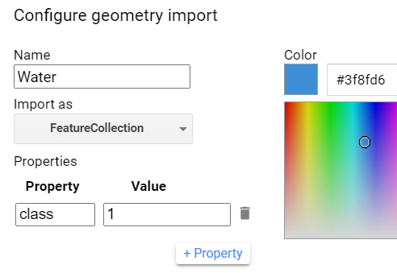

Save the GEE script, Ctrl+S. 

Configure geometry import for Builtup sample. class value 2 for Builtup

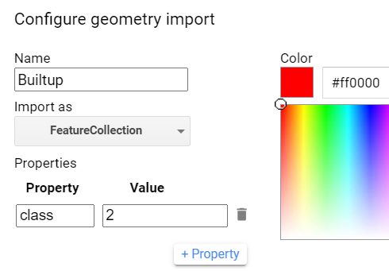

Save the GEE script, Ctrl+S.

Please continue for all other classes (Baresoil:3, Forest:4, Shrubland:5, Rice:6, Grams:7, OtherCrops:8)

Save the GEE script, Ctrl+S.

example of land cover sample list.

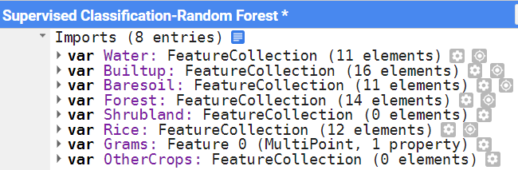

## 2. Input Seasonal Composite Image

We'll use the composite image exported in the earlier session.

In the Tasks pane, go to your completed task list. 

Click on View asset.

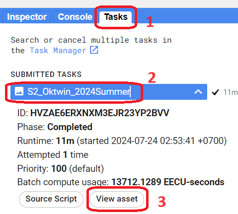

In the image asset, you will see your image ID. 

To share your image from GEE asset to others, click on the SHARE on the upper right of widget.

Enter the reader email or tick Anyone can read.

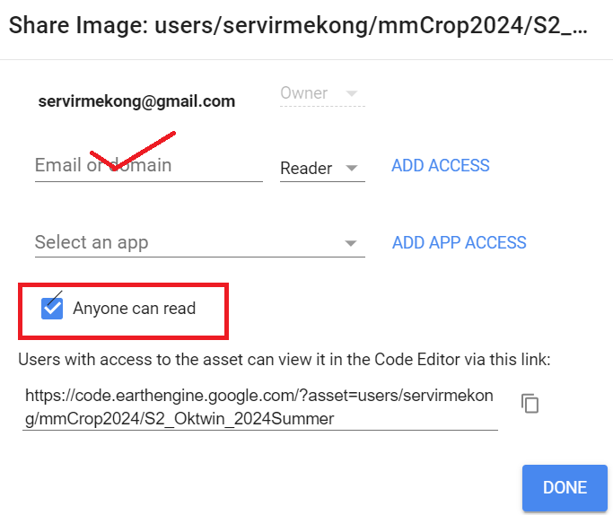

To import the image from your own asset into the current IDE Script, click on **IMPORT** on the upper right window.

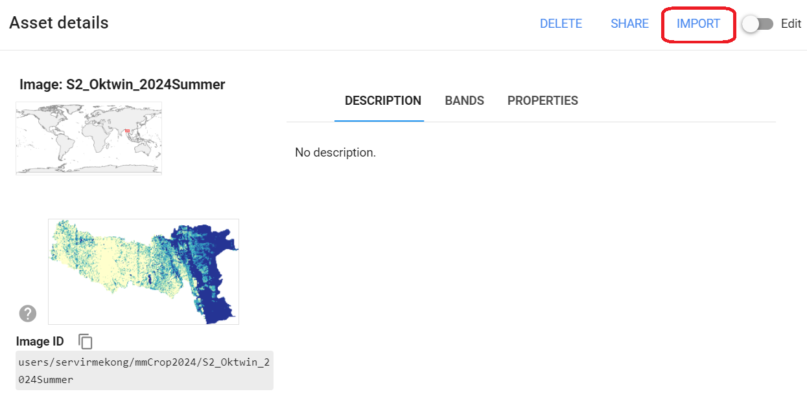

Once successfully imported, now you should see your image on the Imports section at the top of your script. 

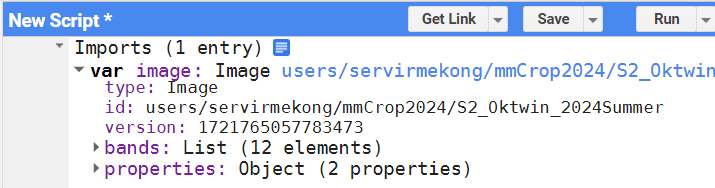

If you want to use your own image composite, please change the image AssetID path accordingly.


```javascript
//// Composite Image
var image = ee.Image("users/servirmekong/mmCrop2024/S2_Oktwin_2024Summer")
```

Rename the Sentinel-2 bands.
We will use only the multispectral band for land cover observation. 

Select Sentinel-2 bands to use in classification

```javascript
//// Rename the Sentinel-2 bands 
//// we will use only the multispectral band for land cover observation
image = image.select(
  ['B2',  'B3',   'B4', 'B5',        'B6',        'B7',        'B8', 'B8A',       'B11',  'B12'],
  ['Blue','Green','Red','Red Edge 1','Red Edge 2','Red Edge 3','NIR','Red Edge 4','SWIR1','SWIR2']
);

// Select Sentinel-2 bands to use in classification
var bands = ['Blue','Green','Red','Red Edge 1','Red Edge 2','Red Edge 3','NIR','Red Edge 4','SWIR1','SWIR2'];
var imageBands = image.select(bands);

Map.centerObject(image)
Map.addLayer(image,visSwir,'input image')
```

endJScript


Input Sentinel-2 **2024 summer season composite image** for ***Oktwin*** township.

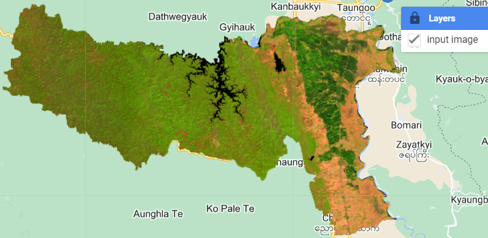

Save the GEE script, Ctrl+S.


### Planet Monthly Image

You can also use monthly planet images to have additional information on crop cultivation activity.

```javascript
//// to use for sample collection
//// Area of Interest
var township = ee.FeatureCollection("projects/ee-khunaung/assets/township2")
print(township.first())
township = township.filter(ee.Filter.eq("TS","Oktwin"));

var feb = ee.Image("projects/planet-nicfi/assets/basemaps/asia/planet_medres_normalized_analytic_2024-02_mosaic").clip(township)
var mar = ee.Image("projects/planet-nicfi/assets/basemaps/asia/planet_medres_normalized_analytic_2024-03_mosaic").clip(township)
var apr = ee.Image("projects/planet-nicfi/assets/basemaps/asia/planet_medres_normalized_analytic_2024-04_mosaic").clip(township)
var planetRGB = {"opacity":1,"bands":["R","G","B"],"min":294.56,"max":1809.44,"gamma":1};
Map.addLayer(feb,planetRGB,'Feb')
Map.addLayer(mar,planetRGB,'Mar')
Map.addLayer(apr,planetRGB,'Apr')
```

Save he GEE Script.

## 3. Training Sample

We can use training sample collected from Geometry Tool and sample from existing GEE asset.

You can use GEE Asset to import huge samples. 

You can use the Geometry tool to handle some hundreds of samples and live updating of samples .

### 3.1. Collect Land Cover Sample using Interactive Geometry Tool

Base image to use

1. 2024 Summer Season Sentinel-2 composite image
2. Google Satellite Base Map
3. Sentinel-2 NDVI time-series profile
4. Planet NICFI monthly image

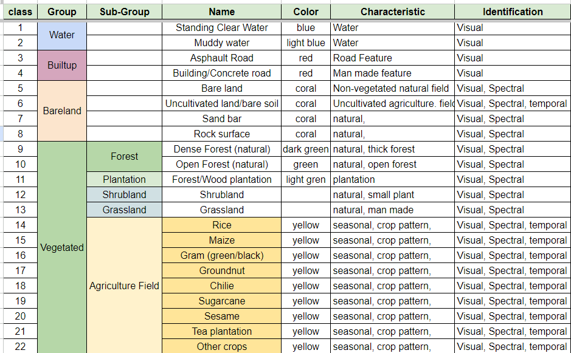

[Link to Sample Land Cover Class Characteristics and Identification](https://bit.ly/mmGEE4CropLCidentification).

#### Water

Map Navigation: Use  tool to drag and move around the image. 

Use Scroll wheel to zoom in/out the map. 

**Zoom to a scle where you can identify the objects (tree, building, road, crop patterns, etc.)**

Search for ***water features*** (river, lake, pond, etc) in the image. Choose Water layer and click on water feature on the image to add water samples.

Identification/Characteristics: Natural feature, visual interpretation of image. permanent water, seasonal water. 

Difficulty Level:

Confident Level: high.

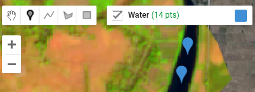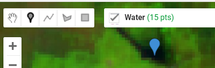

low vegetation on lake water NDVI over time 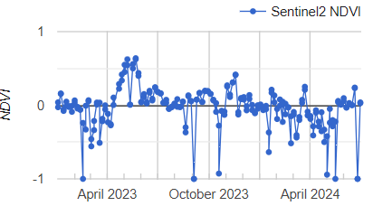 

Save the GEE script, Ctrl+S.

#### Built-up

Hover your mouse on imports list and move the 'Built-up' list to top.

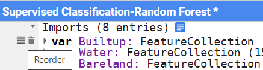

Search for ***man made built-up features*** (building, road, etc) in the image. Choose Built-up layer and click on built-up feature on the image to add samples. Swipe the input image and background high resolution Google Earth Image.

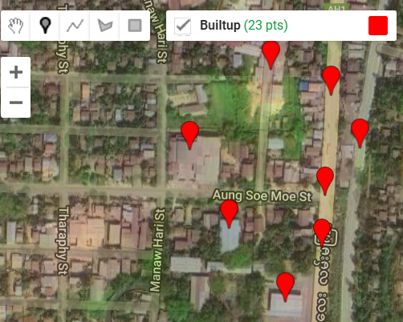

NDVI profile of buit-up area 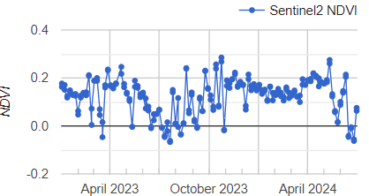 

Identification/Characteristics: man made feature, 

Difficulty Level: low.

Confident Level: high.

Save the GEE script, Ctrl+S.

#### Bareland

Navigate the image to bare land area, uncultivated field and add samples. 

Bareland can be permanent bare land and uncultivated field in the 2024 summer season composite image.

It only represent only for this year, this season and only for this image.

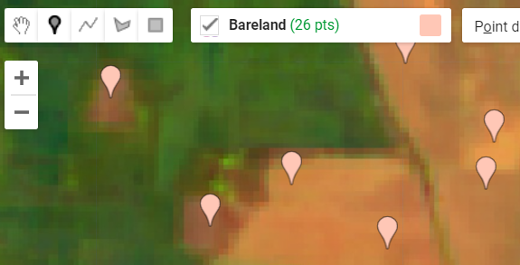

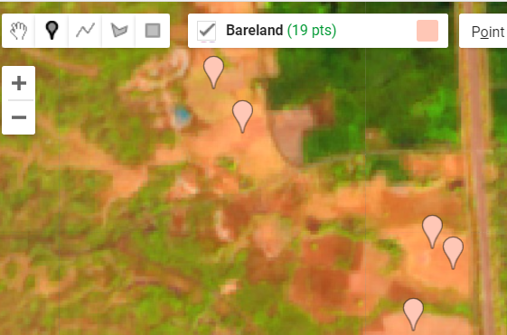

NDVI profile of a harvested land. it is bare soil in 2024 summer seasonal composite image.

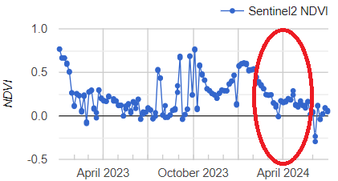

Identification/Characteristics: no vegetation, no crop cultivation activity, 

Difficulty Level: low

Confident Level: high.

Save the GEE script, Ctrl+S.

#### Forest

Search for forest area present in both images. Forrest in high resolution image.

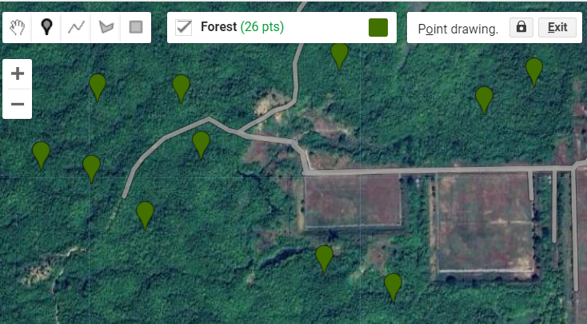

Forest in input Sentinel-2 image

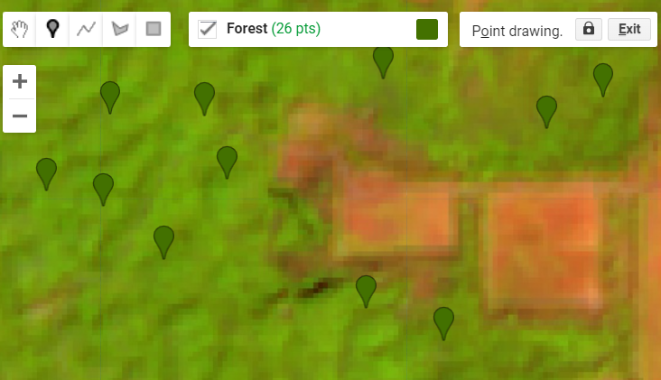

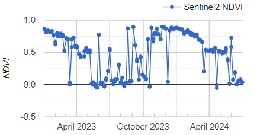 Forest NDVI time-series

Identification/Characteristics: natural feature, trees, long NDVI profile in most of the months.

Difficulty Level: low

Confident Level: high.

Save the GEE script, Ctrl+S.

#### Shrubland

Should check the date in high resolution image in Google Earth Historical images. it should be in the same year (2024 here).

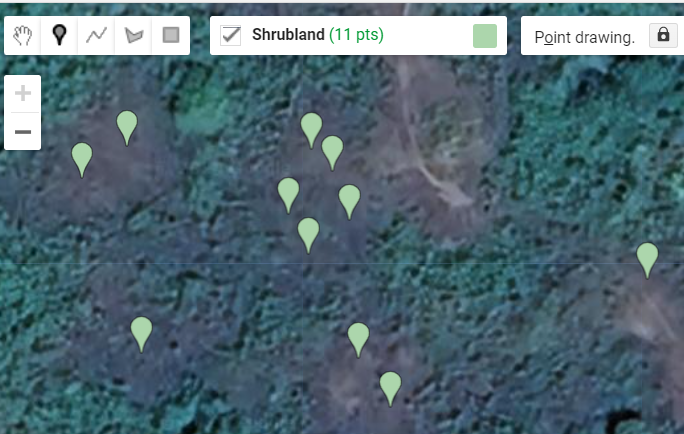

Sentinel-2 image

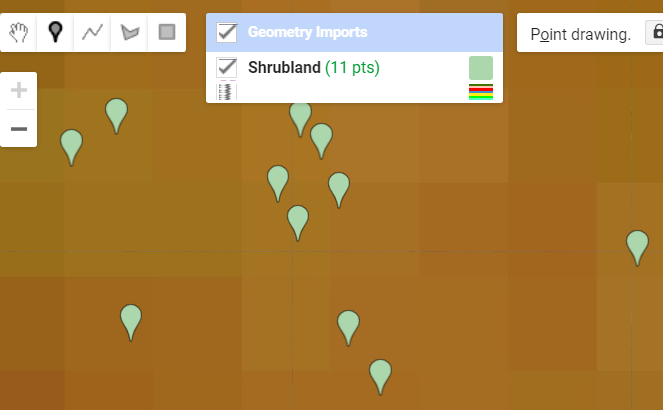


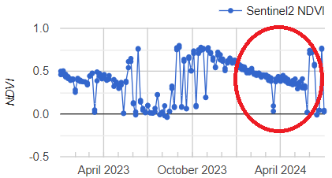

NDVI time-series profile of a shrubland, natural vegetation pattern. No seasonal cropping activity is found in this 2024 summer period.

Identification/Characteristics: bushes, shrubs, no tree or very few tree, high resolution image. it is not agriculture field.

Difficulty Level: medium

Confident Level: medium-high.

Save the GEE script, Ctrl+S.

#### Rice

**The game just starts now!**

Identification/Characteristics: 

1. Rice agriculture field in high resolution Google image. Paddy field in the past rainy season. visual interpretation.

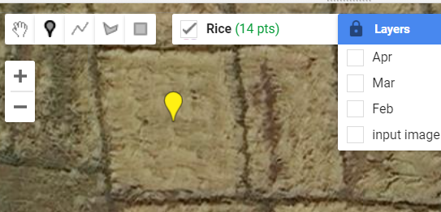

2. Dense vegetation/ green crop field in February - March - April Planet images. Temporal information. cultivation activity.
3. 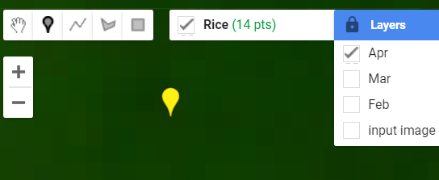

3. Dense vegetation on Sentinel-2 summer season composite image.

   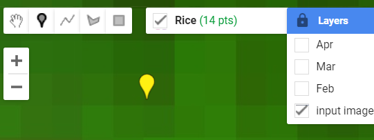

4. Time-series Vegetation Profile shows rainy peak and this summer peak. Crop period is 22 Jan to 11 May (120 days rice variety).

5. 

6. 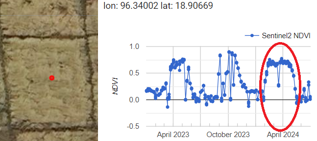

7. Yes. We have field data collection for the surrounding area.


Difficulty Level: medium-high

Confident Level: high.

Szae the GEE script, Ctrl+S.

#### Grams (Green gram/Black gram)

Not known yet.

Identification/Characteristics: 

Difficulty Level:

Confident Level: high.

Save the GEE script, Ctrl+S.

#### Other Crops

other cultivated area which is not rice.

Identification/Characteristics: 

Difficulty Level:

Confident Level: high.

Save the GEE script, Ctrl+S.


### 3.2. Combine Training Sample into one featureCollection

Once we have samples for all land cover classes, we need to combine all sample into one featureCollection.

```javascript
//// combine all training sample into one
var sampleData = ee.FeatureCollection([Water,Forest,Bareland,Builtup,Rice,OtherCrops]).flatten();
```

.

### 3.2 Use Training sample from GEE Asset


startJScript

```javascript
var Rice = ee.FeatureCollection('path to your rice sample');
var Forest = ee.FeatureCollection('path to your forest sample');
//// and so on...;

var sampleData = ee.FeatureCollection([Water,Forest,Bareland,Builtup,Rice,OtherCrops]).flatten();
```


## 4. Supervised Classification

Assign the number of tree to use.

```javascript
var numberOfTrees = 10;
```

a

### 4.1 Sample the image

To perform supervised classification, we need to start taking **samples** from the input image for sample area. 

```javascript
// Sample the input image using land cover training data
var training = imageBands.sampleRegions({
  collection: sampleData,
  properties: ['class'], // Property name that contains class code
  scale: 30
});
```

.

### 4.2. Train the Classifier

 We will use ***Random Forest*** method for classification and use the 'class' as landcover code.

```javascript
// Train the classifier
var classifier = ee.Classifier.smileRandomForest(numberOfTrees).train({
  features: training,
  classProperty: 'class',
  inputProperties: bands
});
```

### 4.2 Classify the image

Once we've got the classification tree, we will apply this to input image to perform classification to the whole image.

```javascript
// Classify the image
var classified = imageBands.classify(classifier);
```

## 5. Classification Result

We create some color for clusters and add to classified image to the map.

```javascript
// Visualization parameters for classified image
var lcVisualization = {
  min: 1,
  max: 8,
  palette: landCoverClasses.map(function(classObj) { return classObj.color; })
};

// Display the results
Map.centerObject(sampleData, 10);
Map.addLayer(classified, lcVisualization, 'Classified Image');
```

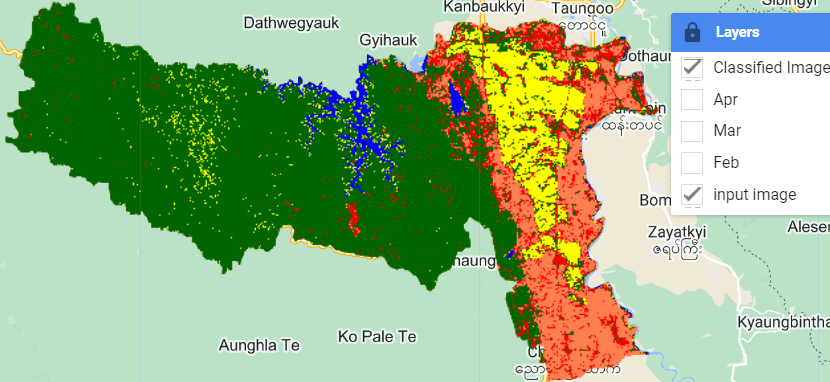

## 6. Map Accuracy 

We can use the sample to evaluate the classified land cover map.

```javascript
// Evaluate the classification
var validation = imageBands.sampleRegions({
  collection: sampleData,
  properties: ['class'], // Property name that contains class code
  scale: 30
});

var validated = validation.classify(classifier);
var errorMatrix = validated.errorMatrix('class', 'classification');
print('Error matrix:', errorMatrix);
print('Overall accuracy:', errorMatrix.accuracy());
```

## 7. Add map legend

Add following code to add legend for land cover classes.

```javascript
// Create a legend
function addLegend(map) {
  var legend = ui.Panel({style: {position: 'bottom-left', padding: '8px 15px'}});
  var legendTitle = ui.Label({value: 'Land Cover Classes', style: {fontWeight: 'bold', fontSize: '18px', margin: '0 0 4px 0', padding: '0'}});
  legend.add(legendTitle);

  landCoverClasses.forEach(function(classObj) {
    var colorBox = ui.Label({
      style: {
        backgroundColor: classObj.color,
        padding: '8px',
        margin: '0 0 4px 0'
      }
    });
    var description = ui.Label({
      value: classObj.name,
      style: {margin: '0 0 4px 6px'}
    });
    legend.add(ui.Panel({widgets: [colorBox, description], layout: ui.Panel.Layout.Flow('horizontal')}));
  });

  map.add(legend);
}

// Add the legend to the map
addLegend(Map);
```

In this exercises, we use unsupervised method to do quick classification to our image without inputting any field data.

The algorithm classified the image and provide clusters.

## 8. Discussion & Assignment

**Discussion**: How good is the resulted land cover map? Is the result map give accurate crop map and why? 

What are the most mixing classes?

**Assignment**: Add more samples to the land cover classes and repeat the classification.


**[[Link to GEE Code].](https://code.earthengine.google.com/c179cbbeb485bff2b32a045436eeafc6)** 

**[Link to Sentinel-2 NDVI time-series](https://code.earthengine.google.com/26890446f44bf4d93dfb7b9051b0e15c).**


-----

Next --> Rice Crop mapping using Random Forest Model


startJScript

```javascript
var image = ee.Image('LANDSAT/LC08/C02/T1_TOA/LC08_133045_20140113');
```

endJScript

End of this session