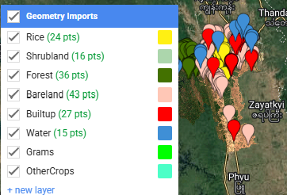

# 11. Machine Learning - Random Forest Model

This tutorial builds the first Random Forest model for land cover mapping using an image that has already been exported and prepared in Google Earth Engine. The main focus is training data preparation: keeping the sample geometries separate, grouping the target land cover class and the non-target land cover classes, assigning binary class codes, training the model, and assessing model accuracy.

## Input

- Prepared composite image:
  `users/servirmekong/mmCrop2024/S2_Oktwin_2024Summer`
- Training sample geometries from:
  `data/samples.txt`
- Target land cover group:
  rice / crop sample class from `Rice`
- Non-target land cover group:
  water, built-up, bare land, forest, and shrubland sample classes
- Original sample class codes from `data/samples.txt`:

| Code | Original sample class |
|---:|---|
| 1 | Water |
| 2 | Built-up |
| 3 | Bare land |
| 4 | Forest |
| 5 | Shrubland |
| 6 | Rice |
| 7 | Grams / optional crop sample |

- Binary model class codes:

| Code | Model class group | Meaning |
|---:|---|---|
| 1 | Target | Land cover class to map |
| 0 | Non-target | Other land cover classes |

## Methodology

1. Put all callable functions first.
2. Put the training samples from `data/samples.txt` in a dedicated Geometry Section.
3. Compile the target land cover group and non-target land cover group in the Main GEE script.
4. Preserve the original sample class as `source_class`.
5. Convert the modeling class to binary codes: target = `1`, non-target = `0`.
6. Merge the target and non-target samples into one model-ready training dataset.
7. Sample the image bands using the training data geometry.
8. Split the sampled data into training and validation sets.
9. Train the first Random Forest model.
10. Classify the image.
11. Assess the model using a confusion matrix, overall accuracy, kappa, producer accuracy, and consumer accuracy.

## Output

- Training data geometry section copied from `data/samples.txt`
- Target / non-target training data compilation
- First Random Forest classification model
- Binary land cover classification map
- Confusion matrix
- Overall accuracy and kappa
- Producer and consumer accuracy
- Optional export of the classification image

## Technology

- Google Earth Engine JavaScript API
- Exported Sentinel-2 composite image
- `ee.FeatureCollection` geometry samples
- `ee.Image.sampleRegions`
- `ee.Classifier.smileRandomForest`
- Confusion matrix accuracy assessment

## Google Earth Engine Code

### Training Data Section

You can convert this into the geometry objects

 

```javascript
https://code.earthengine.google.com/cb5cc4c7904dae0eb14e8c0f47ebb934

```

### Function Section

```javascript


// ======================================================
// FUNCTION SECTION
// Put all callable functions first.
// ======================================================

function setClassCode(featureCollection, classCode, className) {
  return ee.FeatureCollection(featureCollection).map(function(feature) {
    return feature.set({
      source_class: feature.get('class'),
      'class': classCode,
      class_name: className
    });
  });
}

function mergeTrainingGroups(targetSamples, nonTargetSamples) {
  return ee.FeatureCollection(targetSamples)
    .merge(ee.FeatureCollection(nonTargetSamples));
}

function sampleImage(image, trainingData, classProperty, scale) {
  return image.sampleRegions({
    collection: trainingData,
    properties: [classProperty, 'class_name', 'source_class'],
    scale: scale,
    geometries: true,
    tileScale: 4
  });
}

function splitSamples(samples, split, seed) {
  var withRandom = samples.randomColumn('random', seed);

  return {
    training: withRandom.filter(ee.Filter.lt('random', split)),
    validation: withRandom.filter(ee.Filter.gte('random', split))
  };
}

function trainRandomForest(trainingSamples, imageBands, classProperty, numberOfTrees, outputMode) {
  var classifier = ee.Classifier.smileRandomForest({
    numberOfTrees: numberOfTrees,
    seed: 100
  });

  if (outputMode) {
    classifier = classifier.setOutputMode(outputMode);
  }

  return classifier.train({
    features: trainingSamples,
    classProperty: classProperty,
    inputProperties: imageBands
  });
}

function classifyImage(image, classifier) {
  return image.classify(classifier);
}

function classifyTargetProbability(image, probabilityClassifier, targetClassIndex) {
  return image.classify(probabilityClassifier)
    .arrayGet([targetClassIndex])
    .rename('target_probability');
}

function thresholdProbability(probabilityImage, threshold) {
  return probabilityImage.gte(threshold).rename('target_class');
}

function assessAccuracy(validationSamples, classifier, classProperty) {
  var validated = validationSamples.classify(classifier);
  var matrix = validated.errorMatrix(classProperty, 'classification');

  return {
    validated: validated,
    matrix: matrix,
    overallAccuracy: matrix.accuracy(),
    kappa: matrix.kappa(),
    producerAccuracy: matrix.producersAccuracy(),
    consumerAccuracy: matrix.consumersAccuracy()
  };
}

function addBinaryLegend() {
  var legend = ui.Panel({
    style: {
      position: 'bottom-left',
      padding: '8px 15px',
      backgroundColor: 'white'
    }
  });

  legend.add(ui.Label({
    value: 'Random Forest class',
    style: {
      fontWeight: 'bold',
      fontSize: '14px',
      margin: '0 0 6px 0'
    }
  }));

  var rows = [
    {label: '0 - Non-target', color: '#9e9e9e'},
    {label: '1 - Target', color: '#fff013'}
  ];

  rows.forEach(function(row) {
    var colorBox = ui.Label({
      style: {
        backgroundColor: row.color,
        padding: '8px',
        margin: '0 0 4px 0'
      }
    });

    var label = ui.Label({
      value: row.label,
      style: {
        margin: '0 0 4px 6px',
        fontSize: '12px'
      }
    });

    legend.add(ui.Panel(
      [colorBox, label],
      ui.Panel.Layout.Flow('horizontal')
    ));
  });

  Map.add(legend);
}


```


### Main Code Section

```javascript
// ======================================================
/// Main
// Combined raw training data geometry for display and checking.
// Empty optional groups can stay in the geometry section and be added later.
var trainingDataGeometry = ee.FeatureCollection([
  Rice,
  Shrubland,
  Forest,
  Bareland,
  Builtup,
  Water
]).flatten();

// ======================================================
// MAIN SECTION
// Call the functions using INPUT, PROCESS, OUTPUT.
// ======================================================

// ------------------------------------------------------
// 1. INPUT
// ------------------------------------------------------

var image = ee.Image('users/servirmekong/mmCrop2024/S2_Oktwin_2024Summer');

var classProperty = 'class';
var targetCode = 1;
var nonTargetCode = 0;
var scale = 10;
var split = 0.7;
var seed = 100;
var numberOfTrees = 100;
var probabilityThreshold = 0.5;

// Compile target and non-target land cover groups from the Geometry Section.

var targetLandCover = ee.FeatureCollection([Rice]).flatten();

// use flatten method, to avoid merge method for big data
var nonTargetLandCover = ee.FeatureCollection([
  Water,
  Builtup,
  Bareland,
  Forest,
  Shrubland
]).flatten();

// Grams and OtherCrops are kept in the Geometry Section.
// Add them here later if they contain real non-target samples.
// nonTargetLandCover = nonTargetLandCover
//   .merge(ee.FeatureCollection([Grams]))
//   .merge(OtherCrops);

// ------------------------------------------------------
// 2. PROCESS
// ------------------------------------------------------

// Prepare binary training data for the model.
var targetSamples = setClassCode(targetLandCover, targetCode, 'target');
var nonTargetSamples = setClassCode(nonTargetLandCover, nonTargetCode, 'non_target');
var trainingData = mergeTrainingGroups(targetSamples, nonTargetSamples);

// Read all bands from the prepared image.
var imageBands = image.bandNames();

// Extract image band values at the training sample locations.
var samples = sampleImage(image, trainingData, classProperty, scale);

// Split the sampled pixels into training and validation data.
var sampleSplit = splitSamples(samples, split, seed);

// Train the first Random Forest model.
var rfClassifier = trainRandomForest(
  sampleSplit.training,
  imageBands,
  classProperty,
  numberOfTrees,
  'CLASSIFICATION'
);

// Train a second Random Forest model with probability output.
var rfProbabilityClassifier = trainRandomForest(
  sampleSplit.training,
  imageBands,
  classProperty,
  numberOfTrees,
  'MULTIPROBABILITY'
);

// Classify the prepared image.
var classified = classifyImage(image, rfClassifier);

// Create a continuous target probability layer.
// MULTIPROBABILITY returns probabilities in class order: [0, 1].
// Index 1 is the probability of the target class.
var targetProbability = classifyTargetProbability(
  image,
  rfProbabilityClassifier,
  targetCode
);

// Optional binary map from the probability layer.
var thresholdedTarget = thresholdProbability(
  targetProbability,
  probabilityThreshold
);

// Assess model accuracy using the validation samples.
var accuracy = assessAccuracy(
  sampleSplit.validation,
  rfClassifier,
  classProperty
);

// Print full RF model information\
var rfInfo = rfClassifier.explain();\
print('Random Forest model information', rfInfo);\
\
// Extract variable importance from the model information\
var importance = ee.Dictionary(rfInfo.get('importance'));\
\
// ------------------------------------------------------\
// Convert importance dictionary to sorted FeatureCollection\
// ------------------------------------------------------\
\
var importanceFc = ee.FeatureCollection(\
importance.keys().map(function(bandName) {\
bandName = ee.String(bandName);\
var value = ee.Number(importance.get(bandName));\
\
return ee.Feature(null, {\
band: bandName,\
importance: value\
});\
})\
);\
\
// Sort from most important to least important\
var sortedImportance = importanceFc.sort('importance', false);\
\
print('Band importance sorted descending:', sortedImportance);\
\
// ------------------------------------------------------\
// Print band importance chart\
// ------------------------------------------------------\
\
var importanceChart = ui.Chart.feature.byFeature({\
features: sortedImportance,\
xProperty: 'band',\
yProperties: \['importance']\
})\
.setChartType('ColumnChart')\
.setOptions({\
title: 'Random Forest Band Importance',\
hAxis: {\
title: 'Band'\
},\
vAxis: {\
title: 'Importance'\
},\
legend: {\
position: 'none'\
}\
});\
\


// ------------------------------------------------------
// 3. OUTPUT
// ------------------------------------------------------

print('Input image', image);
print('Image bands', imageBands);
print('Raw training data geometry', trainingDataGeometry);
print('Target land cover compilation', targetLandCover);
print('Non-target land cover compilation', nonTargetLandCover);
print('Target samples, class = 1', targetSamples);
print('Non-target samples, class = 0', nonTargetSamples);
print('Merged binary training data', trainingData);
print('Sampled image values', samples);
print('Training sample count', sampleSplit.training.size());
print('Validation sample count', sampleSplit.validation.size());
print('--------------')

print('Random Forest model information', rfClassifier.explain());
print('Random Forest probability model information', rfProbabilityClassifier.explain());
print(importanceChart);

print('--------------')
print('Confusion matrix', accuracy.matrix);
print('Overall accuracy', accuracy.overallAccuracy);
print('Kappa', accuracy.kappa);
print('Producer accuracy', accuracy.producerAccuracy);
print('Consumer accuracy', accuracy.consumerAccuracy);
print('Target probability layer', targetProbability);
print('Probability threshold', probabilityThreshold);


var probability = {"opacity":1,"bands":["target_probability"],"min":0,"max":1,"palette":["0a9121","00ffff","ffff00","ff7f00","ff0000"]};

Map.centerObject(trainingDataGeometry, 9);
Map.setOptions('HYBRID');

Map.addLayer(
  image,
  imageVis,
  'Prepared composite image'
);

Map.addLayer(
  targetLandCover,
  {color: 'fff013'},
  'Target land cover geometry'
);

Map.addLayer(
  nonTargetLandCover,
  {color: '9e9e9e'},
  'Non-target land cover geometry',
  false
);

Map.addLayer(
  trainingData,
  {color: 'yellow'},
  'Binary training data',
  false
);


Map.addLayer(
  targetProbability,
  probability,
  'RF target probability'
);

Map.addLayer(
  thresholdedTarget,
  {
    min: 0,
    max: 1,
    palette: ['9e9e9e', 'fff013']
  },
  'RF probability threshold'
);

Map.addLayer(
  classified,
  {
    min: 0,
    max: 1,
    palette: ['9e9e9e', 'fff013']
  },
  'RF hard classification',
  false
);

addBinaryLegend();

// Optional export.
// Export.image.toDrive({
//   image: targetProbability.toFloat(),
//   description: 'RF_Target_Probability',
//   folder: 'GEE_Exports',
//   fileNamePrefix: 'rf_target_probability',
//   region: trainingDataGeometry.geometry().bounds(),
//   scale: scale,
//   maxPixels: 1e13
// });

```

## Results

Inspect the results from each method. Options are:
1. Random Forest Probability (0-1) result.
2. Random Forest Hard Classifier result
3. 50% Threshold applied to the RF probability layer. Change the threshold to 60% or 70%. Depending on the result, user have control over the 

| Method | Output | Control |
|---|---|---|
| Hard classifier | Final class label, e.g. `0` or `1` | Model decides automatically |
| Probability + threshold | Probability score first, then class | You decide threshold |

   